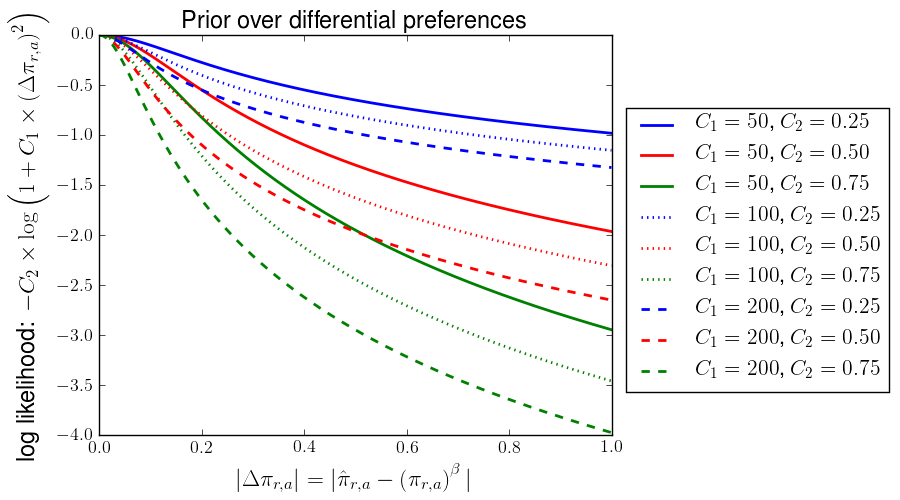

.. _ExpCM:

=======================================================
**Exp**\erimentally Informed **C**\odon **M**\odels
=======================================================

.. contents::
   :depth: 2

Overview
-------------
**Exp**\erimentally Informed **C**\odon **M**\odels (*ExpCM*) describe the evolution of protein-coding genes in terms of their site-specific amino-acid preferences. These models improve on conventional non-site-specific phylogenetic substitution models because they account for the different constraints at different sites of the protein encoded by the gene.

Specifically, for each gene, we assume that we know the preference :math:`\pi_{r,a}` of site :math:`r` for each amino-acid :math:`a` (we constrain :math:`1 = \sum_a \pi_{r,a}`).
Typically, these preferences might be measured in deep mutational scanning experiments.
The preferences represent the effect of each amino-acid mutation at each site, normalized to sum to one.
They can therefore be obtained by simply re-normalizing deep mutational scanning enrichment ratios to sum to one at each site.
For a more involved description of how the preferences can be inferred from deep mutational scanning experimental data, see `Bloom, BMC Bioinformatics, 16:168`_.
Importantly, these amino-acid preferences must be obtained **independently** from the sequence
alignment being analyzed. A deep mutational scanning experiment is an independent means
of obtaining the preferences, but estimating them from the amino-acid frequencies in the alilnment of homologs is **not** a valid approach as you are then estimating the preferences from the same sequences that you are subsequently analyzing.

The *ExpCM* used here are the ones defined in:

    * `Bloom, Biology Direct, 12:1`_

See also `Bloom, Mol Biol Evol, 31:1956-1978`_ and
`Bloom, Mol Biol Evol, 31:2753-2769`_ for more discussion of models of this type.

These experimentally informed site-specific substitution models closely parallel those used in studies that infer the site-specific information from natural sequences; see `Rodrigue and Lartillot, PNAS, 107:4629-4634`_. For a more general discussion of models of this form, see `Halpern and Bruno, Mol Biol Evol, 15:910-917`_ and `McCandlish and Stoltzfus, Quarterly Review of Biology, 89:225-252`_.

Specifically, the *ExpCM* implemented by ``phydms`` have the following components:

    * A reversible model of nucleotide substitution that is assumed to be constant across sites.

    * A reversible model of amino-acid substitution that differs among sites based on the site-specific amino-acid preferences.

    * A *stringency parameter* :math:`\beta` that reflects how strongly the evolution of the gene in nature adheres to the site-specific amino-acid preferences. Under certain assumptions about the correspondence between the preferences and fitness effects of mutatons, :math:`\beta` probably has some connection to effective population size.

    * An :math:`\omega` parameter that reflects that relative rate of nonsynonymous versus synonymous substitutions **after** accounting for fact that the site-specific preferences will typically retard the overall rate of nonsynonymous substitution. This :math:`\omega` is **not** identical to the one that would be inferred using a conventional Goldman-Yang or Muse-Gaut model, since it reflects the relative rates of these two types of substitutions after accounting for the preferences. Indeed, if the preferences perfectly captured the contraints on nature evolution, we might expect :math:`\omega = 1` since there would be no further reduction in the rate of nonsynonymous substitutions after accounting for the site-specific preferences.

Below is an exact definition of the *ExpCM* model, and an explanation of how it is used to fit site-specific measures of selection.

The *ExpCM* substitution model
---------------------------------

The substitution model is in mutation-selection form. The rate of substitution :math:`P_{r,xy}` from codon :math:`x` to codon :math:`y` at site :math:`r` is

.. math::
   :label: Prxy

   P_{r,xy} =
   Q_{xy} \times F_{r,xy}

where :math:`Q_{xy}` is the rate of mutation from *x* to *y* and :math:`F_{r,xy}` represents the selection on this mutation. Note that the mutation terms are identical across sites, but the selection terms are site-specific.

The mutation rate terms :math:`Q_{xy}` are given by what is essentially a `HKY85`_ model. It consists of transition-transversion ratio :math:`\kappa` and four nucleotide frequencies :math:`\phi_{A}`, :math:`\phi_{C}`, :math:`\phi_{G}`, and :math:`\phi_{T}` (these nucleotide frequencies only constitute three independent parameters since they sum to one). The frequencies are the expected nucleotide composition in the **absence** of any selection on amino acids. The mutation rate terms are:

.. math::
   :label: Qxy

   Q_{xy} = \begin{cases}
            0 & \mbox{if $x$ and $y$ differ by more than one nucleotide,} \\
            \phi_w & \mbox{if $x$ can be converted to $y$ by a transversion of a nucleotide to $w$,} \\
            \kappa \times \phi_w & \mbox{if $x$ can be converted to $y$ by a transition of a nucleotide to $w$.} \\
            \end{cases}

The selection terms :math:`F_{r,xy}` are defined in terms of the site-specific amino acid preferences. Let :math:`\pi_{r,a}` denote the preference of site :math:`r` for amino acid :math:`a`, and let :math:`\operatorname{A}\left(x\right)` denote the amino acid encoded by codon :math:`x`. Let :math:`\beta` be a *stringency parameter*, and let :math:`\omega` be a relative rate of nonsynonymous to synonymous mutations. Then the selection terms are:

.. math::
   :label: Frxy

   F_{r,xy} =
   \begin{cases}
   1 & \mbox{if $\mathcal{A}\left(x\right) = \mathcal{A}\left(y\right)$} \\
   \omega & \mbox{if $\mathcal{A}\left(x\right) \ne \mathcal{A}\left(y\right)$ and $\pi_{r,\mathcal{A}\left(x\right)} = \pi_{r,\mathcal{A}\left(y\right)}$} \\
   \omega \times \frac{\ln\left(\left(\pi_{r,\mathcal{A}\left(y\right)}\right)^{\beta} / \left(\pi_{r,\mathcal{A}\left(x\right)}\right)^{\beta}\right)}{1 - \left(\left(\pi_{r,\mathcal{A}\left(x\right)}\right)^{\beta} / \left(\pi_{r,\mathcal{A}\left(y\right)}\right)^{\beta}\right)} & \mbox{otherwise.}
   \end{cases}

Equation :eq:`Frxy` differs from that described in `Bloom, Mol Biol Evol, 31:2753-2769`_ only by the addition of the :math:`\omega` parameter that differentiates nonsynonymous and synonymoust mutations; the equation in that reference was in turn based on the one originally derived by `Halpern and Bruno, Mol Biol Evol, 15:910-917`_ (although note that the Halpern and Bruno equation contains a key typographical error in the denominator). The *stringency parameter* :math:`\beta` has a value of greater than one if natural selection favors high-preference amino acids with greater stringency than suggested by the :math:`\pi_{r,a}` values, and has a value of less than one if natural selection favors high-preference amino acids with less stringency than suggested by the :math:`\pi_{r,a}` values.
The :math:`\omega` parameter is not a ratio of nonsynonymous to synonymous mutations, but rather their relative rates after accounting for the differing preferences among sites.

The stationary state of the model defined by the mutation terms alone is trivially observed to be

.. math::
   q_x = \phi_{x_1} \times \phi_{x_2} \times \phi_{x_3}

where :math:`x_1`, :math:`x_2`, and :math:`x_3` are the nucleotides at positions 1, 2, and 3 of codon :math:`x`, and it is also trivially observed that this mutation-term only model is reversible (since direct substitution easily verifies that :math:`q_x \times Q_{xy} = q_y \times Q_{yx}`).

In `Bloom, Mol Biol Evol, 31:2753-2769`_, it is shown that the stationary state of the model defined by the selection terms alone is

.. math::
   f_{r,x} \propto \left(\pi_{r,\operatorname{A}\left(x\right)}\right)^{\beta},

and furthermore that this selection-term only model is reversible (the derivation in `Bloom, Mol Biol Evol, 31:2753-2769`_ doesn't include the :math:`\omega` term, but carrying through the same derivation with this term yields the above result).

Finally, `Bloom, Mol Biol Evol, 31:2753-2769`_ shows that given these stationary states, the overall model defined by :eq:`Prxy` is reversible and has stationary state

.. math::
   p_{r,x} = \frac{f_{r,x} \times q_x}{\sum_y f_y \times q_y} = \frac{\left(\pi_{r,\operatorname{A}\left(x\right)}\right)^{\beta} \times q_x}{\sum_y \left(\pi_{r,\operatorname{A}\left(y\right)}\right)^{\beta} \times q_y}.

Therefore, assuming that the preferences :math:`\pi_{r,a}` are known *a priori* for all amino acids :math:`a` at all sites :math:`r` (e.g. the preferences have been measured in a deep mutational scanning experiment), the substitution model is completely defined by giving values to the following six parameters: :math:`\omega`, :math:`\beta`, :math:`\kappa`, :math:`\phi_A`, :math:`\phi_C`, and :math:`\phi_G`. When fitting an *ExpCM* for a gene phylogeny, ``phydms`` assumes that these six parameters are constant across all sites, and optimizes their values by maximum likelihood.

Empirical nucleotide frequencies
----------------------------------
The foregoing model has three free parameters (:math:`\phi_A`, :math:`\phi_C`, and :math:`\phi_G`) that are related to the nucleotide frequencies and are independent of the site-specific constraints.
Classically, many substitution models determine the values of these nucleotide frequency parameters by setting them equal to the empirically observed nucleotide frequencies in the alignment rather than fitting them by maximum likelihood.
This procedure is computationally faster.

However, the the *ExpCM* described above, this cannot be done in such a simple fashion.
The reason is that the :math:`\phi_w` parameters give the expected frequence of nucleotide :math:`w` for purely mutation-driven evolution -- but in reality, the observed nucleotide frequencies are also affected by selection on the amino acid usage.
That this is really the case in evolution is easily observed by noting that for many genes, the nucleotide frequencies differ greatly among the first, second, and especially third codon position.
These differences are unlikely to be driven by mutation (which is probably indifferent to the reading frame in which a nucleotide falls), and is instead driven by the fact that selection on the amino-acid usage favors certain nucleotides at some codon positions since that is the only way to encode some amino acids.

However, we can still empirically estimate the :math:`\phi_w` parameters from the alignment frequencies by taking the amino-acid level constraint into account.
Specifically, let :math:`g_w` denote the empirically observed frequency of nucleotide :math:`w` in the alignment, noting that :math:`1 = \sum_w g_w`.
Let :math:`\hat{\phi}_w` be the value of :math:`\phi_w` that yields a stationary state of the substitution model where nucleotide :math:`w` is at frequency :math:`g_w`.
The value of :math:`\hat{\phi}_w` must then satisfy:

.. math::

   g_w & = &
      \frac{1}{L} \sum_r \sum_x \frac{1}{3} N_w\left(x\right) p_{r,x} \\
         & = &
            \frac{1}{3L} \sum_r \frac{\sum_x N_w\left(x\right) f_{r,x} \prod_{k=0}^2 \hat{\phi}_{x_k}}{\sum_y f_{r,y} \prod_{k=0}^2 \hat{\phi}_{y_k}}.

There are three independent :math:`g_w` values and three independent :math:`\phi_w` values (since :math:`1 = \sum_w g_w = \sum_w \hat{\phi}_w`, so we have three equations and three unknowns.
These equations can be solved numerically for :math:`\hat{\phi}_w`, and these empirical estimates can be used in the place of estimating :math:`\phi_w` by maximum likelihood.
Such a procedure speeds the numerical optimization by reducing the number of free parameters that must be optimized.

Gamma-distributed :math:`\omega`
----------------------------------
In codon substitution models, it is common to allow :math:`\omega` to be drawn from several discrete gamma-distributed categories.
For instance, this is what is done for the *M5* variant of the *YNGKP* models described by `Yang, Nielsen, Goldman, and Krabbe Pederson, Genetics, 155:431-449`_.
This can also be done for *ExpCM* by using the ``--gammaomega`` option.
In this case, :math:`\omega` is drawn from ``--ncats`` categories placed at the means of a discretized gamma distribution with shape parameter :math:`\alpha_{\omega}` and inverse scale parameter :math:`\beta_{\omega}`.
Note that the mean :math:`\omega` value is then :math:`\alpha_{\omega} / \beta_{\omega}`.

Gamma-distributed :math:`\beta`
----------------------------------
We can also allow the *ExpCM* :math:`\beta` parameter to be drawn from gamma-distributed categories using the ``--gammabeta`` option.
In this case, :math:`\beta` is drawn from ``--ncats`` categories placed at the means of a discretized gamma distribution with shape parameter :math:`\alpha_{\beta}` and inverse scale parameter :math:`\beta_{\beta}`.
Note that the mean :math:`\beta` value is then :math:`\alpha_{\beta} / \beta_{\beta}`.

Identifying diversifying selection via site-specific :math:`\omega_r` values
------------------------------------------------------------------------------
One type of interesting selection is *diversifying selection*, where there is continual pressure for amino-acid change. Such selection might be expected to occur at sites that are targeted by adaptive immunity or subjected to some other form of selection which constantly favors changes in the protein sequence. At such sites, we expect that the relative rate of nonsynonymous substitutions will be higher than suggested by the site-specific preferences :math:`\pi_{r,a}` due to this diversifying selection.

To detect diversifying selection at specific sites within the framework of the *ExpCM* implemented in ``phydms``, we use an approach that is highly analogous the *FEL* (**f**\ixed **e**\ffects **l**\ikelihood) method described by `Kosakovsky Pond and Frost, Mol Biol Evol, 22:1208-1222`_. Essentially, the tree topology, branch lengths, and all shared model parameters are fixed to their maximum-likelihood values optimized over the entire gene sequence. Then for each site :math:`r`, we fit a site-specific ratio of the rate of synonymous versus nonsynonymous substitutions while holding all holding all the other tree and model parameters constant. Effectively, this is fitting a different :math:`\omega_r` for each site, and so this analysis is indicated as ``--omegabysite`` in the ``phydms`` options.

Specifically, after fixing all of the other parameters as described above, for each site :math:`r` we re-define Equation :eq:`Frxy` as

.. math::
   :label: Frxy_omegabysite

   F_{r,xy} =
   \begin{cases}
   \mu_r & \mbox{if $\mathcal{A}\left(x\right) = \mathcal{A}\left(y\right)$} \\
   \mu_r \times \omega_r & \mbox{if $\mathcal{A}\left(x\right) \ne \mathcal{A}\left(y\right)$ and $\pi_{r,\mathcal{A}\left(x\right)} = \pi_{r,\mathcal{A}\left(y\right)}$} \\
   \mu_r \times \omega_r \times \frac{\ln\left(\left(\pi_{r,\mathcal{A}\left(y\right)}\right)^{\beta} / \left(\pi_{r,\mathcal{A}\left(x\right)}\right)^{\beta}\right)}{1 - \left(\left(\pi_{r,\mathcal{A}\left(x\right)}\right)^{\beta} / \left(\pi_{r,\mathcal{A}\left(y\right)}\right)^{\beta}\right)} & \mbox{otherwise.}
   \end{cases}

and then fit the values for :math:`\mu_r` and :math:`\omega_r`. After this fitting, :math:`\mu_r` can be interpreted as the synonymous rate, and :math:`\mu_r \times \omega_r` as the nonsynonymous rate. The reason that we fit :math:`\mu_r` as well as :math:`\omega_r` is to model variation is synonymous rate; this can be important for the reasons described in the Discussion of `Kosakovsky Pond and Frost, Mol Biol Evol, 22:1208-1222`_. If you use the ``--omegabysite_fixsyn`` option to ``phydms`` then :math:`\mu_r` is not fit, but rather is constrained to one.

The null hypothesis is that :math:`\omega_r = 1`. We compute a P-value for rejection of this null hypothesis using a :math:`\chi_1^2` test to compare the likelihood obtained when fitting both :math:`\mu_r` and :math:`\omega_r` to that obtained when fitting only :math:`\mu_r` and fixing :math:`\omega_r = 1`. See `Kosakovsky Pond and Frost, Mol Biol Evol, 22:1208-1222`_ for a justification for using a :math:`\chi_1^2` test for this type of analysis. Note that the P-values reported by ``phydms`` are **not** adjusted for multiple testing, so you will want to make such an adjustment if you are testng the hypothesis that any site has :math:`\omega_r \ne 1`. Note also that in many cases, the fitted value of :math:`\omega_r` will either be very small (e.g. close to zero) or very large (e.g. close to :math:`\infty`) -- in general, it is more informative to look for sites with small P-values and then simply look to see if :math:`\omega` is > or < 1.

Significant support for a value of :math:`\omega_r > 1` can be taken as evidence for diversifying selection beyond that expected given the constraints encapsulated in the site-specific amino-acid preferences. Significant support for a value of :math:`\omega_r < 1` can be taken as evidence for selection against amino-acid change beyond that expected given the constraints encapsulated in the site-specific amino-acid preferences. Note, however, that if the site-specific preferences don't accurately describe the real constraints, you might get :math:`\omega_r \ne 1` simply because of this fact -- so you will want to examine if sites might be subject to selection that is better described by modulating the stringency parameter :math:`\beta` or by invoking differential preferences, as described below.

Identifying differentially selected amino acids by fitting preferences for each site
---------------------------------------------------------------------------------------
A more complete approach is to examine each site to see the extent to which the preferences for each amino acid in nature differ from those encapsulated in the :math:`\pi_{r,a}` values. The advantage of this approach is that it can identify any form of differential selection (the approach in the previous section works best when the selection in nature is more uniform across amino acids than the :math:`\pi_{r,a}` values), and also that it can pinpoint specific amino acids that are favored or disfavored in natural evolution by an unexpected amount. The disadvantage is that ``phydms`` does not currently implement a good way to statistically test the significance of this type of differential selection, so although you can visualize and assess the selection it's hard to say that any given differential selection is significant at some specific P-value threshold.

To identify differential selection, we first fix the tree / branch lengths and all parameters of the substitution model at their maximum-likelihood values obtained across the whole tree. We then define a new set of 20 preferences for each site :math:`r` that we will denote as :math:`\hat{\pi}_{r,a}` (note that these only represent 19 parameters, as :math:`1 = \sum_a \hat{\pi}_{r,a}`. We then redefine Equation :eq:`Frxy` replacing the :math:`\left(\pi_{r,a}\right)^{\beta}` values with the :math:`\hat{\pi}_{r,a}` values as

.. math::
   :label: Frxy_diffprefs

    F_{r,xy} =
    \begin{cases}
    1 & \mbox{if $\mathcal{A}\left(x\right) = \mathcal{A}\left(y\right)$} \\
    \omega & \mbox{if $\mathcal{A}\left(x\right) \ne \mathcal{A}\left(y\right)$ and $\hat{\pi}_{r,\mathcal{A}\left(x\right)} = \hat{\pi}_{r,\mathcal{A}\left(y\right)}$} \\
    \omega \times \frac{\ln\left(\hat{\pi}_{r,\mathcal{A}\left(y\right)} / \hat{\pi}_{r,\mathcal{A}\left(x\right)}\right)}{1 - \left(\hat{\pi}_{r,\mathcal{A}\left(x\right)} / \hat{\pi}_{r,\mathcal{A}\left(y\right)}\right)} & \mbox{otherwise.}.
    \end{cases}

Simply fitting the model defined above with these 19 :math:`\hat{\pi}_{r,a}` values will probably overfit the data since we are including 19 new parameters. We therefore regularize the parameters by defining a prior that favors :math:`\hat{\pi}_{r,a} = \left(\pi_{r,a}\right)^{\beta}`.

Although a Dirichlet prior peaked on the preferences might seem attractive, it performs poorly in practice because the *maximum a posteriori* is very different for small preferences depending on their exact magnitude -- for instance, under a Dirichlet prior we will have very different costs of increasing the differential preference by 0.1 depending on whether the *a priori* peak estimate is :math:`10^{-3}` or :math:`10^{-4}`. This is undesirable, so instead we use a prior based on the product of inverse-quadratics.

.. math::
   :label: Pr_pi_invquad

   \Pr\left(\left\{\hat{\pi}_{r,a}\right\} \mid \left\{\pi_{r,a}\right\}, \beta\right) = \prod_a \left(\frac{1}{1 + C_1 \times \left(\hat{\pi}_{r,a} - \frac{\left(\pi_{r,a}\right)^{\beta}}{\sum_{a'} \left(\pi_{r,a'}\right)^{\beta}}\right)^2}\right)^{C_2}

or equivalently

.. math::
   :label: log_Pr_pi_invquad

   \log\left[\Pr\left(\left\{\hat{\pi}_{r,a}\right\} \mid \left\{\pi_{r,a}\right\}, \beta\right)\right] = - C_2 \sum_a \log\left(1 + C_1 \times \left(\hat{\pi}_{r,a} - \frac{\left(\pi_{r,a}\right)^{\beta}}{\sum_{a'} \left(\pi_{r,a'}\right)^{\beta}}\right)^2\right)

where :math:`C_1` and :math:`C_2` are concentration parameters specified via the ``--diffprefconc`` option. Larger values of these favor :math:`\hat{\pi}_{r,a}` values that more closely match the :math:`\left(\pi_{r,a}\right)^{\beta}` values (and so favor smaller values of :math:`\Delta\pi_{r,a} = \hat{\pi}_{r,a} - \frac{\left(\pi_{r,a}\right)^{\beta}}{\sum_{a'} \left(\pi_{r,a'}\right)^{\beta}}`).

The ``phydms`` program has reasonable defaults for these concentration parameters, but you can fine tune them with ``--diffprefconc``.

Here is a plot of the log prior (Equation :eq:`log_Pr_pi_invquad`) as a function of :math:`C_1` and :math:`C_2`.

As the plot makes clear, this prior has the desirable feature of penalizing small differential preferences proportionally more than larger ones, which is good if we think that most sites have no differential selection but some have a lot.

To obtain the :math:`\hat{\pi}_{r,a}` values, the ``--diffprefsbysite`` option to ``phydms`` jointly optimizes the product of the prior in Equation :eq:`Pr_pi_invquad` and the likelihood (with fixed tree / branches and other model parameters) using Equation :eq:`Frxy_diffprefs`. In effect, this is the *maximum a posteriori* estimate of the :math:`\hat{\pi}_{r,a}` given the prior defined by Equation :eq:`Pr_pi_invquad`.

One might wonder why ``phydms`` takes the *maximum a posteriori* estimates rather than defining a prior with :math:`\left(\pi_{r,a}\right)^{\beta}` as the *mean* rather than the *mode*, and then sampling from the posterior to obtain the posterior mean estimates. In fact, this procedure would probably be better, but MCMC sampling of the posterior is much more computationally intensive than the *maximum a posteriori* approach.

The actual values reported by ``phydms`` are the *differential preferences*, defined as

.. math::
   :label: diffpref

   \Delta\pi_{r,a} = \hat{\pi}_{r,a} - \frac{\left(\pi_{r,a}\right)^{\beta}}{\sum_{a'} \left(\pi_{r,a'}\right)^{\beta}}.

So a differential preference of :math:`\Delta\pi_{r,a} > 0` suggests that natural evolution favors amino-acid :math:`a` at site :math:`r` more than suggested by the preferences, and a value < 0 suggests that natural evolution disfavors this amino acid. One way to summarize the total difference in preferences is the root-mean-square of the differential preferences at a site, defined as

.. math::
   :label: rms_diffpref

   RMS_{\Delta\pi_{r,a}} = \sqrt{\frac{1}{N_a} \sum_a \left(\Delta\pi_{r,a}\right)^2}.

Another way to summarize the total difference in preferences is the half the absolute sum of the differential preferences, value:

.. math::
   :label: abs_sum_diffpref

   \frac{1}{2} \sum_a \left|\Delta\pi_{r,a}\right|

The theoretical maximum of this quantity is one.

Unfortunately, ``phydms`` does not currently include any method for statistically testing (e.g. P-values) the hypothesis that any given :math:`\Delta\pi_{r,a}` is not equal to zero. So instead, you will have to keep in mind that these values are regularized (and so do not typically become substantially non-zero without some reasonable statistical evidence), and then manually inspect them for interesting trends.

Specifiying diversifying pressure at sites
----------------------------------------------
In some cases, it might be possible to specify *a priori* expections for the diversifying pressure at each site. For instance, viruses benefit from amino-acid change in sites targeted by the immune system and, consequently, these sites have a higher rate of amino-acid substitution than expected given their level of inherent functional constraint. We can incorporate our expectations for diversifying pressure  at specific sites into the selection terms :math:`F_{r,xy}`.

Let :math:`\delta_{r}` be the pre-determined diversifying pressure for amino-acid change at site :math:`r` in the protein. A large positive value of :math:`\delta_r` corresponds to high pressure for amino-acid diversification, and negative value corresponds to expected pressure against amino-acid diversification beyond that captured in the amino-acid preferences.  We then replace :math:`\omega` in Equation :eq:`Frxy` with the expression :math:`\omega\times\left(1+\omega_{2}\times\delta_{r}\right)`, resulting in selection terms:

.. math::
   :label: Frxy_divpressure

   F_{r,xy} =
   \begin{cases}
   1 & \mbox{if $\mathcal{A}\left(x\right) = \mathcal{A}\left(y\right)$} \\
   \omega\times\left(1+\omega_{2}\times\delta_{r}\right) & \mbox{if $\mathcal{A}\left(x\right) \ne \mathcal{A}\left(y\right)$ and $\pi_{r,\mathcal{A}\left(x\right)} = \pi_{r,\mathcal{A}\left(y\right)}$} \\
   \omega\times\left(1+\omega_{2}\times\delta_{r}\right) \times \frac{\ln\left(\left(\pi_{r,\mathcal{A}\left(y\right)}\right)^{\beta} / \left(\pi_{r,\mathcal{A}\left(x\right)}\right)^{\beta}\right)}{1 - \left(\left(\pi_{r,\mathcal{A}\left(x\right)}\right)^{\beta} / \left(\pi_{r,\mathcal{A}\left(y\right)}\right)^{\beta}\right)} & \mbox{otherwise.}
   \end{cases}

Whereas before :math:`\omega` reflected the elevation of non-synonymous substitutin rate (averaged across the entire gene) beyond that expected given the amino-acid preferences, now :math:`\omega` reflects a gene-wide rate of elevated non-synonymous substitution after taking into account the expected sites of diversifying pressure (as represented by :math:`\delta_r`) weighted by :math:`\omega_{2}\times\delta_{r}`. These new selection terms in equation Equation :eq:`Frxy_divpressure` are identical the selection terms in Equation :eq:`Frxy` when :math:`\omega_{2} = 0`.

To ensure a positive value of :math:`\omega\times\left(1+\omega_{2}\times\delta_{r}\right)` with :math:`-\infty<\delta_{r}<\infty`, :math:`\omega` and :math:`\omega_{2}` are constrained in the following ways:

:math:`\omega>0`

:math:`\begin{cases}
\frac{-1}{\max_r\delta_r}<\omega_{2}<\infty & \text{when }\min_r\delta_r>0\\
-\infty<\omega_{2}<\frac{-1}{\min_r\delta_r} & \text{when }\max_r\delta_r<0\\
\frac{-1}{\max_r\delta_r}<\omega_{2}<\frac{-1}{\min_r\delta_r} & \text{otherwise}\\
\end{cases}`

This results in a total of seven free parameters: :math:`\omega`, :math:`\omega_{2}`, :math:`\beta`, :math:`\kappa`, :math:`\phi_A`, :math:`\phi_C`, and :math:`\phi_G`, an increase of one from the model with :math:`F_{r,xy}` defined by Equation :eq:`Frxy`. A likelihood ratio test can therefore by used to test if adding the specified site-specific diversifying pressure represented by the :math:`\delta_r` values actually improves the description of the gene's evolution.

.. include:: weblinks.txt
