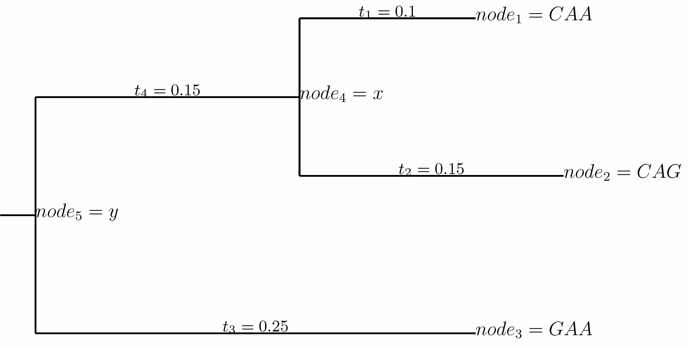

.. _implementation:

=======================================================
Numerical implementation
=======================================================

This page contains some information on the numerical implementation of `phydms`_, particularly in regards to how the likelihoods and its derivatives are computed.
It may be of help in trying to understand the code.

.. contents::
   :depth: 2

*ExpCM* substitution model parameters and derivatives
---------------------------------------------------------
We begin by considering the basic *ExpCM* substitution model defined in :ref:`ExpCM`.
:math:`P_{r,xy}` gives the substitution rate from codon :math:`x` to codon :math:`y \ne x` at site :math:`r`, and is defined by

.. math::
   :label: Prxy

   P_{r,xy} =
   \begin{cases}
   Q_{xy} \times F_{r,xy} & \mbox{if $x \ne y$,} \\
   -\sum\limits_{z \ne x} F_{r,xz} Q_{xz} & \mbox{if $x = y$.}
   \end{cases}

where :math:`Q_{xy}` is the rate of mutation from codon :math:`x` to :math:`y` and is defined by

.. math::
   :label: Qxy

   Q_{xy}
   &=&
   \begin{cases}
   \phi_w & \mbox{if $x$ is converted to $y$ by a single-nucleotide transversion to $w$,} \\
   \kappa \phi_w & \mbox{if $x$ is converted to $y$ by a single-nucleotide transition to $w$,} \\
   0 & \mbox{if $x$ and $y$ differ by more than one nucleotide,} \\
   \end{cases}

where :math:`\kappa` is the transition-transversion ratio and :math:`\phi_w` is the expected frequency of nucleotide :math:`w` in the absence of selection on amino-acid mutation (and so is subject to the constraint :math:`1 = \sum_w \phi_w`).

The "fixation probability" :math:`F_{r,xy}` of the mutation from :math:`x` to :math:`y` is

.. math::
   :label: Frxy

   F_{r,xy}
   &=&
   \begin{cases}
   1 & \mbox{if $\mathcal{A}\left(x\right) = \mathcal{A}\left(y\right)$} \\
   \omega & \mbox{if $\mathcal{A}\left(x\right) \ne \mathcal{A}\left(y\right)$ and $\pi_{r,\mathcal{A}\left(x\right)} = \pi_{r,\mathcal{A}\left(y\right)}$} \\
   \omega \times \frac{-\beta \ln\left(\pi_{r,\mathcal{A}\left(x\right)} / \pi_{r,\mathcal{A}\left(y\right)}\right)}{1 - \left(\pi_{r,\mathcal{A}\left(x\right)} / \pi_{r,\mathcal{A}\left(y\right)}\right)^{\beta}} & \mbox{otherwise.}
   \end{cases}

where :math:`\pi_{r,a}` is the preference of site :math:`r` for amino acid :math:`a`, :math:`\operatorname{A}\left(x\right)` is the amino acid encoded by codon :math:`x`, :math:`\beta` is the *stringency parameter*, and :math:`\omega` is a relative rate of nonsynonymous to synonymous mutations after accounting for the selection encapsulated by the preferences.

We define a variable transformation of the four nucleotide frequency parameters :math:`\phi_w` (three of which are unique).
This transformation aids in numerical optimization.
Specifically, we number the four nucleotides in alphabetical order so that :math:`w = 0` denotes *A*, :math:`w = 1` denotes *C*, :math:`w = 2` denotes *G*, and :math:`w = 3` denotes *T*.
We then define the three free variables :math:`\eta_0`, :math:`\eta_1`, and :math:`\eta_2`, all of which are constrained to fall between zero and one.
For notational convenience in the formulas below, we also define :math:`\eta_3 = 0`; note however that :math:`\eta_3` is not a free parameter, as it is always zero.
We define :math:`\phi_w` in terms of these :math:`\eta_i` variables by

.. math::
   :label: phi_from_eta

   \phi_w = \left(\prod_{i = 0}^{w - 1} \eta_i\right) \left(1 - \eta_w\right)

or conversely

.. math::
   :label: eta_from_phi

   \eta_w = 1 - \phi_w / \left(\prod_{i = 0}^{w - 1} \eta_i\right).

Note that setting :math:`\eta_w = \frac{3 - w}{4 - w}` makes all of the :math:`\phi_w` values equal to :math:`\frac{1}{4}`.

The derivatives are:

.. math::
   :label: dphi_deta

   \frac{\partial \phi_w}{\partial \eta_i}
   & = &
   \begin{cases}
   \left(\prod_{j = 0}^{i - 1} \eta_j\right)\left(\prod_{j = i + 1}^{w - 1}\eta_j\right) \left(1 - \eta_w\right) = \frac{\phi_w}{\eta_i} & \mbox{if $i < w$} \\
   -\prod_{j = 0}^{w - 1} \eta_j = \frac{\phi_w}{\eta_i - 1}& \mbox{if $i = w$} \\
   0 & \mbox{if $i > w$} \\
   \end{cases} \\
   & = &
   \begin{cases}
   \frac{\phi_{w}}{\eta_i - \delta_{iw}} & \mbox{if $i \le w$,} \\
   0 & \mbox{otherwise,}
   \end{cases}

where :math:`\delta_{ij}` is the Kronecker-delta, equal to 1 if :math:`i = j` and 0 otherwise.

Given these definitions, the free parameters in and *ExpCM* model are :math:`\kappa`, :math:`\eta_0`, :math:`\eta_1`, :math:`\eta_2`, :math:`\beta`, and :math:`\omega`.

Here are the derivatives of :math:`P_{r,xy}` with respect to each of these parameters:

.. math::
   :label: dPrxy_dkappa

   \frac{\partial P_{r,xy}}{\partial \kappa}
   &=&
   \begin{cases}
   \frac{P_{r,xy}}{\kappa} & \mbox{if $x$ is converted to $y$ by a transition of a nucleotide to $w$,} \\
   0 & \mbox{if $x$ and $y$ differ by something other than a single transition,} \\
   -\sum\limits_{z \ne x} \frac{\partial P_{r,xz}}{\partial \kappa} & \mbox{if $x = y$.}
   \end{cases}

.. math::
   :label: dPrxy_deta

   \frac{\partial P_{r,xy}}{\partial \eta_i}
   =
   \begin{cases}
   \frac{P_{r,xy}}{\phi_w} \frac{\partial \phi_w}{\partial \eta_i} = \frac{P_{r,xy}}{\eta_i - \delta_{iw}} & \mbox{if $x$ is converted to $y$ by a single-nucleotide mutation to $w \ge i$,} \\
   0 & \mbox{if $i > w$ or $x$ and $y$ differ by more than one nucleotide,} \\
   -\sum\limits_{z \ne x} \frac{\partial P_{r,xz}}{\partial \eta_i} & \mbox{if $x = y$.}
   \end{cases}

.. math::
   :label: dPrxy_domega

   \frac{\partial P_{r,xy}}{\partial \omega} =
   \begin{cases}
   0 & \mbox{if $\operatorname{A}\left(x\right) = \operatorname{A}\left(y\right)$ and $x \ne y$} \\
   \frac{P_{r,xy}}{\omega} & \mbox{if $\operatorname{A}\left(x\right) \ne \operatorname{A}\left(y\right)$,} \\
   -\sum\limits_{z \ne x} \frac{\partial P_{r,xz}}{\partial \omega} & \mbox{if $x = y$.}
   \end{cases}

.. math::
   :label: dPrxy_dbeta

   \frac{\partial P_{r,xy}}{\partial \beta} =
   \begin{cases}
   0 & \mbox{if $\operatorname{A}\left(x\right) = \operatorname{A}\left(y\right)$ and $x \ne y$}, \\
   0 & \mbox{if $\pi_{r,\operatorname{A}\left(x\right)} = \pi_{r,\operatorname{A}\left(y\right)}$ and $x \ne y$}, \\
   \frac{P_{r,xy}}{\beta} + P_{r,xy}
   \frac{\left(\pi_{r,\operatorname{A}\left(x\right)} / \pi_{r,\operatorname{A}\left(y\right)}\right)^{\beta} \times \ln\left(\pi_{r,\operatorname{A}\left(x\right)} / \pi_{r,\operatorname{A}\left(y\right)}\right)}{1 - \left(\pi_{r,\operatorname{A}\left(x\right)} / \pi_{r,\operatorname{A}\left(y\right)}\right)^{\beta}}
   & \mbox{if $\operatorname{A}\left(x\right) \ne \operatorname{A}\left(y\right)$,} \\
   -\sum\limits_{z \ne x} \frac{\partial P_{r,xz}}{\partial \beta} & \mbox{if $x = y$.}
   \end{cases}

*ExpCM* stationary state and derivatives
------------------------------------------
The stationary state of the substitution model defined by :math:`P_{r,xy}` is

.. math::
   :label: prx

   p_{r,x} = \frac{q_x f_{r,x}}{\sum_z q_z f_{r,z}}

where

.. math::
   :label: frx

   f_{r,x} = \left(\pi_{r,\operatorname{A}\left(x\right)}\right)^{\beta}

and

.. math::
   :label: qx

   q_x = \phi_{x_0}\phi_{x_1}\phi_{x_2}

where :math:`x_0`, :math:`x_1`, and :math:`x_2` are the nucleotides at the first, second, and third positions of codon :math:`x`.

The derivatives of the stationary state with respect to :math:`\kappa` and :math:`\omega` are zero as these do not affect that state, so:

.. math::
   :label: dprx_dkappadomega

   \frac{\partial p_{r,x}}{\partial \kappa} = \frac{\partial p_{r,x}}{\partial \omega} = 0

The stationary state is sensitive to the value of :math:`\beta`, with derivative:

.. math::
   :label: dprx_dbeta

   \frac{\partial p_{r,x}}{\partial \beta} &=&
   \frac{p_{r,x}\left[\ln\left(\pi_{r,\operatorname{A}\left(x\right)}\right)\left(\sum_z f_{r,z} q_z\right) - \sum_z \ln\left(\pi_{r,\operatorname{A}\left(z\right)}\right) f_{r,z} q_z\right]}
   {\sum_z q_z f_{r,z}} \\
   &=& p_{r,x} \left(\ln\left(\pi_{r,\operatorname{A}\left(x\right)}\right) - \frac{\sum_z \ln\left(\pi_{r,\operatorname{A}\left(z\right)}\right) f_{r,z} q_z}{\sum_z q_z f_{r,z}}\right) \\
   &=& p_{r,x} \left(\ln\left(\pi_{r,\operatorname{A}\left(x\right)}\right) - \sum_z \ln\left(\pi_{r,\operatorname{A}\left(z\right)}\right) p_{r,z}\right)

The stationary state is also sensitive to the values of :math:`\eta_0`, :math:`\eta_1`, and :math:`\eta_2`:

.. math::
   :label: dprx_detai

   \frac{\partial p_{r,x}}{\partial \eta_i} &=&
   \frac{f_{r,x} \frac{\partial q_x}{\partial \eta_i}\left(\sum_z q_z f_{r,z}\right) - f_{r,x} q_x \left(\sum_z f_{r,z} \frac{\partial q_z}{\partial \eta_i} \right)}
   {\left(\sum_z q_z f_{r,z}\right)^2} \\
   &=& \frac{\partial q_x}{\partial \eta_i}\frac{p_{r,x}}{q_x} - p_{r,x} \frac{\sum_z f_{r,z} \frac{\partial q_z}{\partial \eta_i}}{\sum_z q_z f_{r,z}}

where the :math:`\frac{\partial q_x}{\partial \eta_i}` terms are:

.. math::
   :label: dqx_deta

   \frac{\partial q_x}{\partial \eta_i} & = &
   \frac{\partial \phi_{x_0}}{\partial \eta_i} \phi_{x_1} \phi_{x_2} +
   \frac{\partial \phi_{x_1}}{\partial \eta_i} \phi_{x_0} \phi_{x_2} +
   \frac{\partial \phi_{x_2}}{\partial \eta_i} \phi_{x_0} \phi_{x_1} \\
   & = &
   \sum_{j=0}^{2} \frac{\partial \phi_{x_j}}{\partial \eta_i} \prod_{k \ne j} \phi_{x_k} \\
   & = &
   q_x \sum_{j=0}^{2} \frac{1}{\phi_{x_j}} \frac{\partial \phi_{x_j}}{\partial \eta_i} \\
   & = &
   q_x \sum_{j=0}^{2} \frac{\operatorname{bool}\left(i \le x_j \right)}{\eta_i - \delta_{ix_j}}

where :math:`\operatorname{bool}\left(i \le j\right)` is 1 if :math:`i \le j` and 0 otherwise, and so

.. math::
   :label: dprx_detai_2

   \frac{\partial p_{r,x}}{\partial \eta_i} & = &
   p_{r,x}
   \left[\sum_{j=0}^{2} \frac{\operatorname{bool}\left(i \le x_j \right)}{\eta_i - \delta_{ix_j}} - \frac{\sum_z f_{r,z} q_z \sum_{j=0}^{2} \frac{\operatorname{bool}\left(i \le z_j \right)}{\eta_i - \delta_{iz_j}}}{\sum_z q_z f_{r,z}} \right] \\
   & = &
   p_{r,x}
   \left[\sum_{j=0}^{2} \frac{\operatorname{bool}\left(i \le x_j \right)}{\eta_i - \delta_{ix_j}} - \frac{\sum_z p_{r,z} \sum_{j=0}^{2} \frac{\operatorname{bool}\left(i \le z_j \right)}{\eta_i - \delta_{iz_j}}}{\sum_z p_{r,z}} \right]
   \\

*ExpCM* with empirical nucleotide frequencies
----------------------------------------------
In the description above, the nucleotide frequencies :math:`\phi_w` are fit as three free parameters.
Now let's consider the case where we instead calculate them empirically to give a stationary state that implies nucleotide frequencies that match those empirically observed in the alignment.
This should be beneficial in terms of optimization because it reduces the number of model parameters that need to be optimized.

Let :math:`g_w` be the empirical frequency of nucleotide :math:`w` taken over all sites and sequences in the alignment.
Obviously, :math:`1 = \sum_w g_w`.
We want to empirically set :math:`\phi_w` to some value :math:`\hat{\phi}_w` such that when :math:`q_x = \hat{\phi}_{x_0} \hat{\phi}_{x_1} \hat{\phi}_{x_2}` then

.. math::
   :label: phihat

   g_w & = &
   \frac{1}{L} \sum_r \sum_x \frac{1}{3} N_w\left(x\right) p_{r,x} \\
   & = &
   \frac{1}{3L} \sum_r \frac{\sum_x N_w\left(x\right) f_{r,x} \prod_{k=0}^2 \hat{\phi}_{x_k}}{\sum_y f_{r,y} \prod_{k=0}^2 \hat{\phi}_{y_k}} \\

where :math:`N_w\left(x\right) = \sum_{k=0}^2 \delta_{x_k, w}` is the number of occurrence of nucleotide :math:`w` in codon :math:`x`, :math:`r` ranges over all codon sites in the gene, :math:`x` ranges over all codons, and :math:`k` ranges over the first three nucleotides.

There are three independent :math:`g_w` values and three independent :math:`\hat{\phi}_w` values (since :math:`1 = \sum_w g_w = \sum_w \hat{\phi}_w`), so we have three equations and three unknowns.
We could not solve the set of three equations analytically for the :math:`\hat{\phi}_w` values, so instead we use a non-linear equation solver to determine their values.

When using empirical nucleotide frequencies, we no longer need to calculate any derivatives with respect to :math:`\eta_i` as we no longer have the :math:`\eta_i` free parameters.

However, now the value of :math:`\phi_w = \hat{\phi}_w` depends on :math:`\beta` via the :math:`f_{r,x}` parameters in Equation :eq:`phihat`.
So we need new formulas for :math:`\frac{\partial p_{r,x}}{\partial \beta}` and :math:`\frac{\partial P_{r,xy}}{\partial \beta}` that accounts for this dependency.

Since we do not have an analytic expression for :math:`\hat{\phi}_w`, we cannot compute :math:`\frac{\partial \phi_w}{\partial \beta}` analytically.
But we can compute these derivatives numerically.
This is done using a finite-difference method.

We now update the formula in Equation :eq:`dPrxy_dbeta` for the case when :math:`\phi_w` depends on :math:`\beta`. In that case, we have:

.. math::
   :label: dQxy_dbeta_empirical_phi

   \frac{\partial Q_{xy}}{\partial \beta} =
   \begin{cases}
   \frac{\partial \phi_w}{\partial \beta} & \mbox{if $x$ is converted to $y$ by a single-nucleotide transversion to $w$,} \\
   \kappa \frac{\partial \phi_w}{\partial \beta} & \mbox{if $x$ is converted to $y$ by a single-nucleotide transition to $w$,} \\
   0 & \mbox{if $x$ and $y$ differ by more than one nucleotide,} \\
   \end{cases}

and

.. math::
   :label: dFrxy_dbeta_empirical_phi

   \frac{\partial F_{r,xy}}{\partial \beta}
   &=&
   \begin{cases}
   0 & \mbox{if $\mathcal{A}\left(x\right) = \mathcal{A}\left(y\right)$} \\
   0 & \mbox{if $\mathcal{A}\left(x\right) \ne \mathcal{A}\left(y\right)$ and $\pi_{r,\mathcal{A}\left(x\right)} = \pi_{r,\mathcal{A}\left(y\right)}$} \\
   \frac{F_{r,xy} \left(1 - \frac{F_{r,xy}}{\omega} \left(\pi_{r,\operatorname{A}\left(x\right)} / \pi_{r,\operatorname{A}\left(y\right)}\right)^{\beta}\right)}{\beta}
   & \mbox{otherwise,}
   \end{cases}

so for all :math:`x \ne y`, we have

.. math::
   :label: dPrxy_dbeta_empirical_phi

   \frac{\partial P_{r,xy}}{\partial \beta}
   & = &
   \frac{\partial \left(Q_{xy} \times F_{r,xy}\right)}{\partial \beta} \\
   & = &
   Q_{xy} \frac{\partial F_{r,xy}}{\partial \beta} + F_{r,xy} \frac{\partial Q_{xy}}{\partial \beta} \\
   & = &
   \left[\frac{\partial P_{r,xy}}{\partial \beta}\right]_{\mbox{free } \phi_w} + F_{r,xy} \frac{\partial Q_{xy}}{\partial \beta}.

where :math:`\left[\frac{\partial P_{r,xy}}{\partial \beta}\right]_{\mbox{free } \phi_w}` is the expression given by Equation :eq:`dPrxy_dbeta`.
When :math:`x = y`, we have :math:`\frac{\partial P_{r,xx}}{\partial \beta} = \sum\limits_{z \ne x} -\frac{\partial P_{r,xz}}{\partial \beta}`.

We also must update the formula in Equation :eq:`dprx_dbeta` for the case where :math:`\phi_w` depends on :math:`\beta`.
We have:

.. math::
   :label: dqx_dbeta_empirical_phi

   \frac{\partial q_x}{\partial \beta}
   & = &
   \frac{\partial \left(\phi_{x_0} \phi_{x_1} \phi_{x_2}\right)}{\partial \beta} \\
   & = &
   \sum\limits_{j=0}^2 \frac{\partial \phi_{x_j}}{\partial \beta} \prod_{k \ne j} \phi_{x_k} \\
   & = &
   q_x \sum\limits_{j=0}^2 \frac{1}{\phi_{x_j}} \frac{\partial \phi_{x_j}}{\partial \beta}

and

.. math::
   :label: dfrx_dbeta_empirical_phi

   \frac{\partial f_{r,x}}{\partial \beta}
   =
   f_{r,x} \left[\ln\left(\pi_{r,\operatorname{A}\left(x\right)}\right)\right].

So:

.. math::
   :label: dprx_dbeta_empirical_phi

   \frac{\partial p_{r,x}}{\partial \beta}
   & = &
   \frac{\partial}{\partial \beta} \left(\frac{q_x f_{r,x}}{\sum_z q_z f_{r,z}}\right) \\
   & = &
   \frac{\left(q_x \frac{\partial f_{r,x}}{\partial \beta} + f_{r,x} \frac{\partial q_x}{\partial \beta}\right) \sum_z q_z f_{r,z} - q_x f_{r,x} \sum_z \left(q_z \frac{\partial f_{r,z}}{\partial \beta} + f_{r,z} \frac{\partial q_z}{\partial \beta}\right)}{\left(\sum_z q_z f_{r,z}\right)^2} \\
   & = &
   \frac{\left(q_x f_{r,x} \left[\ln\left(\pi_{r,\operatorname{A}\left(x\right)}\right)\right] + f_{r,x} q_x \sum\limits_{j=0}^2 \frac{1}{\phi_{x_j}} \frac{\partial \phi_{x_j}}{\partial \beta}\right) \sum_z q_z f_{r,z} - q_x f_{r,x} \sum_z \left(q_z f_{r,z} \left[\ln\left(\pi_{r,\operatorname{A}\left(z\right)}\right)\right] + f_{r,z} q_z \sum\limits_{j=0}^2 \frac{1}{\phi_{z_j}} \frac{\partial \phi_{z_j}}{\partial \beta}\right)}{\left(\sum_z q_z f_{r,z}\right)^2} \\
   & = &
   p_{r,x} \frac{\left(\left[\ln\left(\pi_{r,\operatorname{A}\left(x\right)}\right)\right] + \sum\limits_{j=0}^2 \frac{1}{\phi_{x_j}} \frac{\partial \phi_{x_j}}{\partial \beta}\right) \sum_z q_z f_{r,z} - \sum_z \left(q_z f_{r,z} \left[\ln\left(\pi_{r,\operatorname{A}\left(z\right)}\right)\right] + f_{r,z} q_z \sum\limits_{j=0}^2 \frac{1}{\phi_{z_j}} \frac{\partial \phi_{z_j}}{\partial \beta}\right)}{\sum_z q_z f_{r,z}} \\
   & = &
   p_{r,x} \left[\left[\ln\left(\pi_{r,\operatorname{A}\left(x\right)}\right)\right] + \sum\limits_{j=0}^2 \frac{1}{\phi_{x_j}} \frac{\partial \phi_{x_j}}{\partial \beta} - \sum_z p_{r,z}\left(\left[\ln\left(\pi_{r,\operatorname{A}\left(z\right)}\right)\right] + \sum\limits_{j=0}^2 \frac{1}{\phi_{z_j}} \frac{\partial \phi_{z_j}}{\partial \beta}\right)\right] \\
   & = &
   \left[\frac{\partial p_{r,x}}{\partial \beta}\right]_{\mbox{free } \phi_w} +
   p_{r,x} \left[\sum\limits_{j=0}^2 \frac{1}{\phi_{x_j}} \frac{\partial \phi_{x_j}}{\partial \beta} - \sum_z p_{r,z}\sum\limits_{j=0}^2 \frac{1}{\phi_{z_j}} \frac{\partial \phi_{z_j}}{\partial \beta}\right]

where :math:`\left[\frac{\partial p_{r,x}}{\partial \beta}\right]_{\mbox{free } \phi_w}` is the expresssion given by Equation :eq:`dprx_dbeta`.

*ExpCM* with empirical nucleotide frequencies and diversifying pressure
-------------------------------------------------------------------------
The :math:`\omega` value in the previous models is the gene-wide relative rate of nonsynonymous to synonymous mutations after accounting for the differing preferences among sites.
In some cases, it might be possible to specify *a priori* expections for the diversifying pressure at each site.
For instance, viruses benefit from amino-acid change in sites targeted by the immune system and, consequently, these sites have a higher rate of amino-acid substitution than expected given their level of inherent functional constraint.
We can incorporate our expectations for diversifying pressure at specific sites into the selection terms :math:`F_{r,xy}`.

Let :math:`\delta_{r}` be the pre-determined diversifying pressure for amino-acid change at site :math:`r` in the protein. A large positive value of :math:`\delta_r` corresponds to high pressure for amino-acid diversification, and negative value corresponds to expected pressure against amino-acid diversification beyond that captured in the amino-acid preferences.  We then replace :math:`\omega` in Equation :eq:`Frxy` with the expression :math:`\omega\times\left(1+\omega_{2}\times\delta_{r}\right)`, resulting in selection terms:

.. math::
   :label: Frxy_divpressure

   F_{r,xy} =
   \begin{cases}
   1 & \mbox{if $\mathcal{A}\left(x\right) = \mathcal{A}\left(y\right)$} \\
   \omega\times\left(1+\omega_{2}\times\delta_{r}\right) & \mbox{if $\mathcal{A}\left(x\right) \ne \mathcal{A}\left(y\right)$ and $\pi_{r,\mathcal{A}\left(x\right)} = \pi_{r,\mathcal{A}\left(y\right)}$} \\
   \omega\times\left(1+\omega_{2}\times\delta_{r}\right) \times \frac{\ln\left(\left(\pi_{r,\mathcal{A}\left(y\right)}\right)^{\beta} / \left(\pi_{r,\mathcal{A}\left(x\right)}\right)^{\beta}\right)}{1 - \left(\left(\pi_{r,\mathcal{A}\left(x\right)}\right)^{\beta} / \left(\pi_{r,\mathcal{A}\left(y\right)}\right)^{\beta}\right)} & \mbox{otherwise.}
   \end{cases}

Whereas before :math:`\omega` reflected the elevation of non-synonymous substitution rate (averaged across the entire gene) beyond that expected given the amino-acid preferences, now :math:`\omega` reflects a gene-wide rate of elevated non-synonymous substitution after taking into account the expected sites of diversifying pressure (as represented by :math:`\delta_r`) weighted by :math:`\omega_{2}\times\delta_{r}`. These new selection terms in equation Equation :eq:`Frxy_divpressure` are identical the selection terms in Equation :eq:`Frxy` when :math:`\omega_{2} = 0`.

To ensure a positive value of :math:`\omega\times\left(1+\omega_{2}\times\delta_{r}\right)`, we constrain :math:`\omega>0`, :math:`-1<\omega_2<\infty`, and :math:`\lvert\max_r\delta_r\rvert\le1`.

We have added one more parameter to Equation :eq:`Prxy`, :math:`\omega_2`, so we need to add a new derivative, :math:`\frac{\partial P_{r,xy}}{\partial \omega_2}` :eq:`dPrxy_domega2_divpressure`.

.. math::
   :label: dPrxy_domega2_divpressure

   \frac{\partial P_{r,xy}}{\partial \omega_2} =
   \begin{cases}
   0 & \mbox{if $\operatorname{A}\left(x\right) = \operatorname{A}\left(y\right)$ and $x \ne y$} \\
   \omega \times \delta_r \times \frac{\ln\left(\left(\pi_{r,\mathcal{A}\left(y\right)}\right)^{\beta} / \left(\pi_{r,\mathcal{A}\left(x\right)}\right)^{\beta}\right)}{1 - \left(\left(\pi_{r,\mathcal{A}\left(x\right)}\right)^{\beta} / \left(\pi_{r,\mathcal{A}\left(y\right)}\right)^{\beta}\right)} \times Q_{xy} & \mbox{if $\operatorname{A}\left(x\right) \ne \operatorname{A}\left(y\right)$,} \\
   -\sum\limits_{z \ne x} \frac{\partial P_{r,xy}}{\partial \omega_2} & \mbox{if $x = y$.}
   \end{cases}.

*ExpCM* with the preferences as free parameters
------------------------------------------------
In most situations, the amino-acid preferences :math:`\pi_{r,a}` are experimentally measured.
But in certain situations, we wish to treat these as free parameters that we optimize by maximum likelihood.
There are two different implementations of how this is done, instantiated in the ``ExpCM_fitprefs`` and ``ExpCM_fitprefs2`` classes.
These classes differ in how the preferences are represented as parameters, and so may have different optimization efficiencies.

First, we describe aspects general to both implementations, then we describe the details specific to each.

The :math:`F_{r,xy}` terms defined by Equation :eq:`Frxy` depend on :math:`\pi_{r,a}`.
The derivative is

.. math::
   :label: dFrxy_dpi

   \frac{\partial F_{r,xy}}{\partial \pi_{r,a}} &=&
   \begin{cases}
   \left(\delta_{a\mathcal{A}\left(y\right)} - \delta_{a\mathcal{A}\left(x\right)} \right) \frac{\omega \beta}{2 \pi_{r,a}} & \mbox{if $\pi_{r, \mathcal{A}\left(x\right)} = \pi_{r,\mathcal{A}\left(y\right)}$}, \\
   \left(\delta_{a\mathcal{A}\left(y\right)} - \delta_{a\mathcal{A}\left(x\right)} \right) \frac{\omega \beta}{\pi_{r,a}} \frac{\left(\pi_{r,\mathcal{A}\left(x\right)} / \pi_{r,\mathcal{A}\left(y\right)}\right)^{\beta}\left[\ln\left(\left(\frac{\pi_{r,\mathcal{A}\left(x\right)}}{\pi_{r,\mathcal{A}\left(y\right)}}\right)^{\beta}\right) - 1\right] + 1}{\left(1 - \left(\frac{\pi_{r,\mathcal{A}\left(x\right)}}{\pi_{r,\mathcal{A}\left(y\right)}}\right)^{\beta}\right)^2} & \mbox{if $\pi_{r, \mathcal{A}\left(x\right)} \ne \pi_{r,\mathcal{A}\left(y\right)}$}, \\
   \end{cases}

where the expressions when :math:`\pi_{r,\mathcal{A}\left(x\right)} = \pi_{r,\mathcal{A}\left(y\right)}` are derived from application of L'Hopital's rule, and :math:`\delta_{ij}` is the Kronecker delta.

Define

.. math::

   \tilde{F}_{r,xy} =
   \begin{cases}
   0 & \mbox{if $\mathcal{A}\left(x\right) = \mathcal{A}\left(y\right)$,} \\
   \frac{\omega \beta}{2} & \mbox{if $\mathcal{A}\left(x\right) \ne \mathcal{A}\left(y\right)$ and $\pi_{r, \mathcal{A}\left(x\right)} = \pi_{r,\mathcal{A}\left(y\right)}$,} \\
   \left(\omega \beta\right) \frac{\left(\pi_{r,\mathcal{A}\left(x\right)} / \pi_{r,\mathcal{A}\left(y\right)}\right)^{\beta}\left[\ln\left(\left(\frac{\pi_{r,\mathcal{A}\left(x\right)}}{\pi_{r,\mathcal{A}\left(y\right)}}\right)^{\beta}\right) - 1\right] + 1}{\left(1 - \left(\frac{\pi_{r,\mathcal{A}\left(x\right)}}{\pi_{r,\mathcal{A}\left(y\right)}}\right)^{\beta}\right)^2} & \mbox{if $\mathcal{A}\left(x\right) \ne \mathcal{A}\left(y\right)$ and $\pi_{r, \mathcal{A}\left(x\right)} \ne \pi_{r,\mathcal{A}\left(y\right)}$,}
   \end{cases}

so that

.. math::

   \frac{\partial F_{r,xy}}{\partial \pi_{r,a}} = \left(\delta_{a\mathcal{A}\left(y\right)} - \delta_{a\mathcal{A}\left(x\right)} \right) \frac{\tilde{F}_{r,xy}}{\pi_{r,a}}.

We also need to calculate the derivative of the stationary state :math:`p_{r,x}` given by Equation :eq:`prx` with respect to the preference. In this calculation, we simplify the algebra by taking advantage of the fact that for our fit preferences models, we always have :math:`\beta = 1` to simplify from the first to the second line below:

.. math::
   :label: dprx_dpi

   \frac{\partial p_{r,x}}{\partial \pi_{r,a}} &=&
   \frac{\partial}{\partial \pi_{r,x}}\left(\frac{q_x \left(\pi_{r,\mathcal{A}\left(x\right)}\right)^{\beta}}{\sum_z q_z \left(\pi_{r,\mathcal{A}\left(z\right)}\right)^{\beta}}\right) \\
   &=&
   \frac{\partial}{\partial \pi_{r,x}}\left(\frac{q_x \pi_{r,\mathcal{A}\left(x\right)}}{\sum_z q_z \pi_{r,\mathcal{A}\left(z\right)}}\right) \\
   &=&
   \frac{q_x \delta_{a\mathcal{A}\left(x\right)}\left( \sum_z q_z \pi_{r,\mathcal{A}\left(z\right)}\right) - q_x \pi_{r,\mathcal{A}\left(x\right)} \times \sum_z q_z \delta_{a\mathcal{A}\left(z\right)} }{\left( \sum_z q_z \pi_{r,\mathcal{A}\left(z\right)} \right)^2} \\
   &=&
   \delta_{a\mathcal{A}\left(x\right)} \frac{p_{r,x}}{\pi_{r,a}} - p_{r,x} \sum_z\delta_{a\mathcal{A}\left(z\right)} \frac{p_{r,z}}{\pi_{r,a}}.

``ExpCM_fitprefs`` implementation
~~~~~~~~~~~~~~~~~~~~~~~~~~~~~~~~~~~~
We define a variable transformation from the 20 :math:`\pi_{r,a}` values at each site :math:`r` (19 of these 20 values are unique since they sum to one).
This transformation is analogous to that in Equations :eq:`phi_from_eta` and :eq:`eta_from_phi`.
Specifically, we number the 20 amino acids such that :math:`a = 0` means alanine, :math:`a = 1` means cysteine, and so on up to :math:`a = 19` meaning tyrosine..
We then define 19 free variables for each site :math:`r`: :math:`\zeta_{r,0}, \zeta_{r,1}, \ldots, \zeta_{r,18}`, all of which are constrained to value between zero and one.
For notational convenience, we also define :math:`\zeta_{r,19} = 0`, but not that :math:`\zeta_{r,19}` is **not** a free parameter as it is always zero.

We the define

.. math::
   :label: pi_from_zeta

   \pi_{r,a} = \left(\prod\limits_{i=0}^{a - 1} \zeta_{r,i}\right) \left(1 - \zeta_{r,a}\right)

and conversely

.. math::
   :label: zeta_from_pi

   \zeta_{r,a} = 1 - \pi_{r,a} / \left(\prod\limits_{i=0}^{a - 1} \zeta_{r,i} \right).

Note that setting :math:`\zeta_{r,a} = \frac{19 - a}{20 - a}` makes all the :math:`\pi_{r,a}` values equal to :math:`\frac{1}{20}`.

In analogy with Equation :eq:`dphi_deta`, we have

.. math::
   :label: dpi_dzeta

   \frac{\partial \pi_{r,a}}{\partial \zeta_{r,i}} =
   \begin{cases}
   \frac{\pi_{r,a}}{\zeta_{r,i} - \delta_{ia}} & \mbox{if $i \le a$,} \\
   0 & \mbox{otherwise,}
   \end{cases}

where :math:`\delta_{ij}` is the Kronecker-delta.

We then have

.. math::
   :label: dPrxy_dzeta

   \frac{\partial P_{r,xy}}{\partial \zeta_{r,i}} =
   Q_{xy} \sum\limits_a \frac{\partial F_{r,xy}}{\partial \pi_{r,a}} \frac{\partial \pi_{r,a}}{\partial \zeta_{r,i}} =
   \begin{cases}
   0 & \mbox{if $i > \mathcal{A}\left(x\right)$ and $i > \mathcal{A}\left(y\right)$ and $x \ne y$,} \\
   \frac{Q_{xy} \tilde{F}_{r,xy}}{\zeta_{r,i} - \delta_{i\mathcal{A}\left(y\right)}} & \mbox{if $i > \mathcal{A}\left(x\right)$ and $i \le \mathcal{A}\left(y\right)$ and $x \ne y$,} \\
   -\frac{Q_{xy} \tilde{F}_{r,xy}}{\zeta_{r,i} - \delta_{i\mathcal{A}\left(x\right)}} & \mbox{if $i \le \mathcal{A}\left(x\right)$ and $i > \mathcal{A}\left(y\right)$ and $x \ne y$,} \\
   \frac{Q_{xy} \tilde{F}_{r,xy}}{\zeta_{r,i} - \delta_{i\mathcal{A}\left(y\right)}} - \frac{Q_{xy} \tilde{F}_{r,xy}}{\zeta_{r,i} - \delta_{i\mathcal{A}\left(x\right)}} & \mbox{if $i \le \mathcal{A}\left(x\right)$ and $i \le \mathcal{A}\left(y\right)$ and $x \ne y$} \\
   -\sum\limits_{z \ne x} \frac{\partial P_{r,xy}}{\partial \zeta_{r,i}} & \mbox{if $x = y$}.
   \end{cases}

We also have:

.. math::
   :label: dprx_dzeta

   \frac{\partial p_{r,x}}{\partial \zeta_{r,i}} &=&
   \sum\limits_a \frac{\partial p_{r,x}}{\partial \pi_{r,a}} \frac{\partial \pi_{r,a}}{\partial \zeta_{r,i}} \\
   &=& p_{r,x} \sum\limits_{a \ge i} \frac{1}{\zeta_{r,i} - \delta_{ia}} \left(\delta_{a\mathcal{A}\left(x\right)} - \sum_z\delta_{a\mathcal{A}\left(z\right)} p_{r,z} \right).

``ExpCM_prefs2`` implementation
~~~~~~~~~~~~~~~~~~~~~~~~~~~~~~~~
For this implementation, we define a different variable transformation from the 20 :math:`\pi_{r,a}` values at each site :math:`r` (19 of these 20 values are unique since they sum to one).
We define 19 free variables for each site :math:`r`: :math:`\zeta_{r,0}, \zeta_{r,1}, \ldots, \zeta_{r,18}`, all of which are constrained to be greater than zero.
For notational convenience, we also define :math:`\zeta_{r,19} = 1`, but not that :math:`\zeta_{r,19}` is **not** a free parameter as it is always one.

We then define

.. math::
   :label: pi_from_zeta2

   \pi_{r,a} = \frac{\zeta_{r,a}}{\sum_{j} \zeta_{r,j}}

and conversely

.. math::
   :label: zeta_from_pi2

   \zeta_{r,a} = \frac{\pi_{r,a}}{\pi_{r,19}}.

We therefore have

.. math::
   :label: dpi_dzeta2

   \frac{\partial \pi_{r,a}}{\partial \zeta_{r,i}} &=&
   \frac{1}{\sum_{j} \zeta_{r,j}} \left(\delta_{ia} - \frac{\zeta_{r,a}}{\sum_{j} \zeta_{r,j}}\right) \\
   &=& \frac{\pi_{r,a}}{\zeta_{r,a}} \left(\delta_{ia} - \pi_{r,a}\right)

where :math:`\delta_{ij}` is the Kronecker-delta.

We then have

.. math::
   :label: dPrxy_dzeta2

   \frac{\partial P_{r,xy}}{\partial \zeta_{r,i}} &=&
   Q_{xy} \sum\limits_a \frac{\partial F_{r,xy}}{\partial \pi_{r,a}} \frac{\partial \pi_{r,a}}{\partial \zeta_{r,i}} \\
   &=& Q_{xy} \tilde{F}_{r,xy} \sum\limits_a \left(\delta_{a\mathcal{A}\left(y\right)} - \delta_{a\mathcal{A}\left(x\right)} \right) \frac{1}{\zeta_{r,a}} \left(\delta_{ia} - \pi_{r,a}\right) \\
   &=& Q_{xy} \tilde{F}_{r,xy} \left[\left(\sum\limits_a \left(\delta_{a\mathcal{A}\left(y\right)} - \delta_{a\mathcal{A}\left(x\right)} \right) \frac{\delta_{ia}}{\zeta_{r,a}}\right) - \left(\sum\limits_a \left(\delta_{a\mathcal{A}\left(y\right)} - \delta_{a\mathcal{A}\left(x\right)} \right) \frac{\pi_{r,a}}{\zeta_{r,a}}\right)\right] \\
   &=& Q_{xy} \tilde{F}_{r,xy} \left[\frac{\delta_{i\mathcal{A}\left(y\right)} - \delta_{i\mathcal{A}\left(x\right)}}{\zeta_{r,i}} - \left(\sum\limits_a \left(\delta_{a\mathcal{A}\left(y\right)} - \delta_{a\mathcal{A}\left(x\right)} \right) \frac{\pi_{r,a}}{\zeta_{r,a}}\right)\right] \\
   &=& Q_{xy} \tilde{F}_{r,xy} \left[\frac{\delta_{i\mathcal{A}\left(y\right)} - \delta_{i\mathcal{A}\left(x\right)}}{\zeta_{r,i}} - \left(\frac{1}{\sum_j \zeta_{r,j}}\sum\limits_a \left(\delta_{a\mathcal{A}\left(y\right)} - \delta_{a\mathcal{A}\left(x\right)} \right) \right)\right] \\
   &=& Q_{xy} \tilde{F}_{r,xy} \left[\frac{\delta_{i\mathcal{A}\left(y\right)} - \delta_{i\mathcal{A}\left(x\right)}}{\zeta_{r,i}}\right].

We also have:

.. math::
   :label: dprx_dzeta2

   \frac{\partial p_{r,x}}{\partial \zeta_{r,i}} &=&
   \sum\limits_a \frac{\partial p_{r,x}}{\partial \pi_{r,a}} \frac{\partial \pi_{r,a}}{\partial \zeta_{r,i}} \\
   &=& p_{r,x} \sum\limits_{a} \frac{\delta_{ia} - \pi_{r,a}}{\zeta_{r,a}} \left(\delta_{a\mathcal{A}\left(x\right)} - \sum_z\delta_{a\mathcal{A}\left(z\right)} p_{r,z} \right) \\
   &=& p_{r,x} \left[\frac{1}{\zeta_{r,i}} \left(\delta_{i\mathcal{A}\left(x\right)} - \sum_z\delta_{i\mathcal{A}\left(z\right)} p_{r,z} \right) - \sum\limits_{a} \frac{\pi_{r,a}}{\zeta_{r,a}} \left(\delta_{a\mathcal{A}\left(x\right)} - \sum_z\delta_{a\mathcal{A}\left(z\right)} p_{r,z} \right)\right] \\
   &=& p_{r,x} \left[\frac{1}{\zeta_{r,i}} \left(\delta_{i\mathcal{A}\left(x\right)} - \sum_z\delta_{i\mathcal{A}\left(z\right)} p_{r,z} \right) - \frac{\pi_{r,\mathcal{A}\left(x\right)}}{\zeta_{r,\mathcal{A}\left(x\right)}} + \sum\limits_{a} \frac{\pi_{r,a}}{\zeta_{r,a}} \sum_z\delta_{a\mathcal{A}\left(z\right)} p_{r,z}\right] \\
   &=& p_{r,x} \left[\frac{1}{\zeta_{r,i}} \left(\delta_{i\mathcal{A}\left(x\right)} - \sum_z\delta_{i\mathcal{A}\left(z\right)} p_{r,z} \right) - \frac{1}{\sum_j \zeta_{r,j}} + \frac{1}{\sum_j \zeta_{r,j}} \sum\limits_{a} \sum_z\delta_{a\mathcal{A}\left(z\right)} p_{r,z}\right] \\
   &=& \frac{p_{r,x}}{\zeta_{r,i}} \left(\delta_{i\mathcal{A}\left(x\right)} - \sum_z\delta_{i\mathcal{A}\left(z\right)} p_{r,z} \right).

Regularizing preferences for *ExpCM* with preferences as free parameters
-------------------------------------------------------------------------
When the preferences are free parameters, we typically want to regularize them to avoid fitting lots of values of one or zero.
We do this by defining a regularizing prior over the preferences, and then maximizing the product of the likelihood and this regularizing prior (essentially, the *maximum a posteriori* estimate).

Inverse-quadratic prior
~~~~~~~~~~~~~~~~~~~~~~~~~~
This is the prior used in `Bloom, Biology Direct, 12:1`_ (note that the notation used here is slightly different than in that reference).
Let :math:`\pi_{r,a}` be the preference that we are trying to optimize, and let :math:`\theta_{r,a}` be our prior estimate of :math:`\pi_{r,a}`.
Typically, this estimate is the original experimentally measured preference :math:`\pi_{r,a}^{\rm{orig}}` re-scaled by the optimized stringency parameter :math:`\beta`, namely :math:`\theta_{r,a} = \frac{\left(\pi_{r,a}^{\rm{orig}}\right)^{\beta}}{\sum_{a'} \left(\pi_{r,a'}^{\rm{orig}}\right)^{\beta}}`.

The prior is then

.. math::

   \Pr\left(\left\{\pi_{r,a}\right\} \mid \left\{\theta_{r,a}\right\}\right) =
   \prod\limits_r \prod\limits_a \left(\frac{1}{1 + C_1 \times \left(\pi_{r,a} - \theta_{r,a}\right)^2}\right)^{C_2}.

or

.. math::

   \ln\left[ \Pr\left(\left\{\pi_{r,a}\right\} \mid \left\{\theta_{r,a}\right\}\right) \right] = -C_2 \sum\limits_r \sum\limits_a \ln\left(1 + C_1 \times \left(\pi_{r,a} - \theta_{r,a}\right)^2 \right)

where :math:`C_1` and :math:`C_2` are parameters that specify how concentrated the prior is (larger values make the prior more strongly peaked at :math:`\theta_{r,a}`).

The derivative is

.. math::

   \frac{\partial \ln\left[ \Pr\left(\left\{\pi_{r,a}\right\} \mid \left\{\theta_{r,a}\right\}\right) \right]}{\partial \pi_{r,a}} =
   \frac{-2 C_1 C_2 \left(\pi_{r,a} - \theta_{r,a}\right)}{1 + C_1 \times \left(\pi_{r,a} - \theta_{r,a}\right)^2},

This prior can then be defined in terms of the transformation variable for the ``ExpCM_fitprefs`` or ``ExpCM_fitprefs2`` implementation:

``ExpCM_fitprefs`` implementation
++++++++++++++++++++++++++++++++++++
.. math::

   \frac{\partial \ln\left[ \Pr\left(\left\{\pi_{r,a}\right\} \mid \left\{\theta_{r,a}\right\}\right) \right]}{\partial \zeta_{r,i}}
      &=& \sum\limits_a \frac{\partial \ln\left[ \Pr\left(\left\{\pi_{r,a}\right\} \mid \left\{\theta_{r,a}\right\}\right) \right]}{\partial \pi_{r,a}} \frac{\partial \pi_{r,a}}{\partial \zeta_{r,i}} \\
         &=& -2 C_1 C_2 \sum\limits_{a \ge i} \frac{\left(\pi_{r,a} - \theta_{r,a}\right)}{1 + C_1 \times \left(\pi_{r,a} - \theta_{r,a}\right)^2 } \frac{\pi_{r,a}}{\zeta_{r,i} - \delta_ia}.

``ExpCM_fitprefs2`` implementation
++++++++++++++++++++++++++++++++++++

.. math::

   \frac{\partial \ln\left[ \Pr\left(\left\{\pi_{r,a}\right\} \mid \left\{\theta_{r,a}\right\}\right) \right]}{\partial \zeta_{r,i}}
   &=& \sum\limits_a \frac{\partial \ln\left[ \Pr\left(\left\{\pi_{r,a}\right\} \mid \left\{\theta_{r,a}\right\}\right) \right]}{\partial \pi_{r,a}} \frac{\partial \pi_{r,a}}{\partial \zeta_{r,i}} \\
   &=& -2 C_1 C_2 \sum\limits_{a} \frac{\left(\pi_{r,a} - \theta_{r,a}\right)}{1 + C_1 \times \left(\pi_{r,a} - \theta_{r,a}\right)^2 } \frac{\pi_{r,a}}{\zeta_{r,a}}\left(\delta_{ia} - \pi_{r,a}\right) \\
   &=& \frac{-2 C_1 C_2}{\sum_j\zeta_{r,j}} \sum\limits_{a} \frac{\left(\pi_{r,a} - \theta_{r,a}\right)}{1 + C_1 \times \left(\pi_{r,a} - \theta_{r,a}\right)^2 } \left(\delta_{ia} - \pi_{r,a}\right).

*YNGKP_M0* model
------------------
We consider the basic Goldman-Yang style *YNGKP_M0* substitution model defined in `Yang, Nielsen, Goldman, and Krabbe Pederson, Genetics, 155:431-449`_.
This model is **not** site-specific.
:math:`P_{xy}` is the substitution rate from codon `x` to codon `y` and is defined by

.. math::
  :label: Pxy_M0

  P_{xy} =
  \begin{cases}
  0 & \mbox{if $x$ and $y$ differ by more than one nucleotide,}\\
  \mu \omega \Phi_{y} & \mbox{if $x$ is converted to $y$ by a single-nucleotide transversion,} \\
  \kappa \mu \omega \Phi_{y} & \mbox{if $x$ is converted to $y$ by a single-nucleotide transition,} \\
  -\sum\limits_{z \ne x} P_{xz} & \mbox{if $x = y$.}
  \end{cases}

where :math:`\kappa` is the transition-transversion ratio, :math:`\Phi_y` is the equilibrium frequency of
codon :math:`y`, :math:`\omega` is the gene-wide rate of non-synonymous change, and :math:`\mu` is the substitution rate.
Typically :math:`\Phi_y` is determined empirically as described below,
and :math:`\kappa` and :math:`\omega` are optimized by maximum likelihood.

The derivatives are:

.. math::
   :label: dPxy_dkappa_M0

   \frac{\partial P_{xy}}{\partial \kappa}
   &=&
   \begin{cases}
   \frac{P_{xy}}{\kappa} & \mbox{if $x$ is converted to $y$ by a transition of a nucleotide to $w$,} \\
   0 & \mbox{if $x$ and $y$ differ by something other than a single transition,} \\
   -\sum\limits_{z \ne x} \frac{\partial P_{xz}}{\partial \kappa} & \mbox{if $x = y$.}
   \end{cases}

.. math::
      :label: dPxy_domega_M0

      \frac{\partial P_{xy}}{\partial \omega} =
      \begin{cases}
      0 & \mbox{if $\operatorname{A}\left(x\right) = \operatorname{A}\left(y\right)$ and $x \ne y$} \\
      \frac{P_{xy}}{\omega} & \mbox{if $\operatorname{A}\left(x\right) \ne \operatorname{A}\left(y\right)$,} \\
      -\sum\limits_{z \ne x} \frac{\partial P_{xz}}{\partial \omega} & \mbox{if $x = y$.}
      \end{cases}

The stationary state of the substitution model defined by :math:`P_{xy}` is

.. math::
  :label: px_M0

  p_{x} = \Phi_x

The derivatives of the stationary state with respect to :math:`\kappa` and :math:`\omega` are zero as these do not affect that state, so:

.. math::
   :label: dprx_dkappadomega_M0

   \frac{\partial p_{x}}{\partial \kappa} = \frac{\partial p_{x}}{\partial \omega} = 0

We calculate the codon frequencies :math:`\Phi_x` from the observed nucleotide frequencies.

The original *F3X4* method calculated :math:`\Phi_x` directly from the empirical alignment frequencies. Specifically, let :math:`e^p_w` be the empirical frequency of nucleotide :math:`w` at codon position :math:`p`. In the original *F3X4* method,
:math:`\Phi_x = e^1_{x_1} \times e^2_{x_2} \times e^3_{x_3}`.
This method produces biased codon frequencies because the stop codon nucleotide composition is not taken into account.

To address this issue, we follow the *Corrected F3X4* (or *CF3X4*) method from `Pond et al, PLoS One, 5:e11230`_.
The 12 nucleotide corrected nucleotide frequency parameters :math:`\phi_w^p` are estimated from the observed nucleotide frequencies by solving a set of 12 nonlinear equations:

.. math::
      :label: phi_pw

      e^1_w = \frac{\phi^1_w \times \left(1- \sum\limits_{wyz\epsilon X} \phi^2_y\times\phi^3_z\right)}{1-\sum\limits_{xyz\epsilon X} \phi^1_x\times\phi^2_y\times\phi^3_z}\\
      e^2_w = \frac{\phi^2_w \times \left(1- \sum\limits_{ywz\epsilon X} \phi^1_y\times\phi^3_z\right)}{1-\sum\limits_{xyz\epsilon X} \phi^1_x\times\phi^2_y\times\phi^3_z}\\
      e^3_w = \frac{\phi^3_w \times \left(1- \sum\limits_{yzw\epsilon X} \phi^1_y\times\phi^2_z\right)}{1-\sum\limits_{xyz\epsilon X} \phi^1_x\times\phi^2_y\times\phi^3_z}\\

where :math:`X = \{TAA, TAG, TGA\}`. We use the :math:`\phi^p_w` values determined in this way to compute :math:`\Phi_x = \phi^1_{x_1} \times \phi^2_{x_2} \times \phi^3_{x_3}`.

Exponentials of the substitution matrix and derivatives
--------------------------------------------------------
The definitions above can be used to define a set of matrices :math:`\mathbf{P_r} = \left[P_{r,xy}\right]` that give the rate of transition from codon :math:`x` to :math:`y` at site :math:`r`. A key computation is to compute the probability of a transition in some amount of elapsed time :math:`\mu t`. These probabilities are given by

.. math::
   :label: Mr

   \mathbf{M_r}\left(\mu t\right) = e^{\mu t\mathbf{P_r}}.

In this section, we deal with how to compute :math:`\mathbf{M_r}\left(\mu t\right)` and its derivatives.

Because :math:`\mathbf{P_r}` is reversible with stationary state given by the vector :math:`\mathbf{p_r} = \left[p_{r,x}\right]`, then as described by `Bryant, Galtier, and Poursat (2005) <http://www.maths.otago.ac.nz/~dbryant/Papers/04IHPLikelihood.pdf>`_, the matrix :math:`\left[\operatorname{diag}\left(\mathbf{p_r}\right)\right]^{\frac{1}{2}} \mathbf{P_r} \left[\operatorname{diag}\left(\mathbf{p_r}\right)\right]^{\frac{-1}{2}}` is symmetric.

We can use a numerical routine to compute the eigenvalues and orthonormal eigenvectors.
Let :math:`\mathbf{D_r}` be a diagonal matrix with elements equal to the eigenvalues, let :math:`\mathbf{B_r}` be the matrix whose columns are the right orthonormal eigenvectors (in the same order as the eigenvalues), and note that :math:`\mathbf{B_r}^{-1} = \mathbf{B_r}^T`.
Then we have :math:`\left[\operatorname{diag}\left(\mathbf{p_r}\right)\right]^{\frac{1}{2}} \mathbf{P_r} \left[\operatorname{diag}\left(\mathbf{p_r}\right)\right]^{\frac{-1}{2}} = \mathbf{B_r} \mathbf{D_r} \mathbf{B_r}^T` or equivalently

.. math::

   \mathbf{P_r} = \mathbf{A_r} \mathbf{D_r} \mathbf{A_r}^{-1}

where

.. math::

   \mathbf{A_r} = \left[\operatorname{diag}\left(\mathbf{p_r}\right)\right]^{\frac{-1}{2}} \mathbf{B_r}

and

.. math::

   \mathbf{A_r}^{-1} = \mathbf{B_r}^T \left[\operatorname{diag}\left(\mathbf{p_r}\right)\right]^{\frac{1}{2}}.

The matrix exponentials are then easily calculated as

.. math::

   \mathbf{M_r}\left(\mu t\right) = e^{\mu t\mathbf{P_r}} = \mathbf{A_r} e^{\mu t \mathbf{D_r}} \mathbf{A_r}^{-1}

We also want to calculate the derivatives of :math:`\mathbf{M_r}\left(\mu t\right)` with respect to the other parameters on which :math:`P_{r,xy}` depends (e.g., :math:`\beta`, :math:`\eta_i`, :math:`\kappa`, and :math:`\omega`).

According to `Kalbeisch and Lawless (1985) <https://www.jstor.org/stable/2288545?seq=1#page_scan_tab_contents>`_ (see also `Kenney and Gu (2012) <http://www.mathstat.dal.ca/~hgu/hession.pdf>`_ and `Bloom et al (2011) <http://dx.plos.org/10.1371/journal.pone.0022201>`_), the derivative with respect to some parameter :math:`z` is given by

.. math::

   \frac{\partial \mathbf{M_r}\left(\mu t\right)}{\partial z} = \mathbf{A_r} \mathbf{V_{r,z}} \mathbf{A_r}^{-1}

where the elements of :math:`\mathbf{V_{r,z}}` are

.. math::

   V_{xy}^{r,z} =
   \begin{cases}
   B_{xy}^{r,z} \frac{\exp\left(\mu t D^r_{xx}\right) - \exp\left(\mu t D^r_{yy}\right)}{D^r_{xx} - D^r_{yy}} & \mbox{if $x \ne y$ and $D_{xx}^r \ne D_{yy}^r$}, \\
   B_{xy}^{r,z} \mu t \exp\left(\mu t D^r_{xx}\right) & \mbox{if $x \ne y$ and $D_{xx}^r = D_{yy}^r$}, \\
   B_{xx}^{r,z} \mu t \exp\left(\mu t D_{xx}^r\right)& \mbox{if $x = y$},
   \end{cases}

where :math:`D^r_{xx}` and :math:`D^r_{yy}` are the diagonal elements of :math:`\mathbf{D_r}`, and :math:`B_{xy}^{r,z}` are the elements of the matrix :math:`\mathbf{B_{r,z}}` defined by

.. math::

   \mathbf{B_{r,z}} = \mathbf{A_r}^{-1} \frac{\partial \mathbf{P_r}}{\partial z} \mathbf{A_r}.

Scaling the branch lengths with a mutation rate
-------------------------------------------------
The aforementioned section defines the substitution probabilities in terms of :math:`\mu t` (e.g., Eq. :eq:`Mr`).
Here :math:`\mu` is a substitution rate, and :math:`t` is the branch length.
If we are freely optimizing all branch lengths, then we just set :math:`\mu = 1` so that :math:`\mu t = t`, and then :math:`\mu` effectively drops out.
However, if we have fixed the branch lengths are **not** optimizing them, then we might want to include a parameter :math:`\mu` that effectively re-scales all the fixed branch lengths by a constant.
In this case, :math:`\mu` also becomes a free parameter of the model, and we want to compute the derivative of :math:`\mathbf{M_r}\left(\mu t\right)` with respect to :math:`\mu`. This is straightforward:

.. math::

   \frac{\partial \mathbf{M_r}\left(\mu t\right)}{\partial \mu} = t \mathbf{P_r} e^{\mu t \mathbf{P_r}} = t \mathbf{P_r} \mathbf{M_r}\left(\mu t\right).

Calculating the likelihood and derivatives on a tree
------------------------------------------------------
Above we describe computing the transition probabilities as a function of branch length.
Here we consider how to use those computations to compute the actual likelihoods on a tree.

   The tree used in the example calculation below.

We begin by computing the likelihood of the alignment at a specific site.
Let :math:`\mathcal{S}_r` denote the set of aligned codons at site :math:`r`, let :math:`\mathcal{T}` by the phylogenetic tree with branch lengths specified, and let :math:`\mathbf{P_r}` be the transition matrix at site :math:`r` defined above.
Then the likelihood at site :math:`r` is :math:`\Pr\left(\mathcal{S}_r \mid \mathcal{T}, \mathbf{P_r}\right)`.
For the example tree above, we can use the pruning algorithm (`Felsenstein, J Mol Evol, 1981`_) to write

.. math::

   \Pr\left(\mathcal{S}_r \mid \mathcal{T}, \mathbf{P_r}\right)
   =
   \sum_y p_{r,y} M_{r,yGAA}\left(t_3\right) \left[\sum_x M_{r,yx}\left(t_4\right) M_{r,xCAA}\left(t_1\right) M_{r,xCAG}\left(t_2\right)\right].

Let :math:`n` denote a node on a tree, let :math:`t_n` denote the length of the branch leading to node :math:`n`, and let :math:`\mathcal{d}_1\left(n\right)` and :math:`\mathcal{d}_1\left(n\right)` denote the right and left descendents of node :math:`n` for all non-terminal nodes.
Then define the *partial conditional likelihood* of the subtree rooted at :math:`n` as:

.. math::

   L_{r,n}\left(x\right) =
   \begin{cases}
   \delta_{x\mathcal{S}_{r,n}} & \mbox{if $n$ is a tip node with codon $\mathcal{S}_{r,n}$ at site $r$,} \\
   1 & \mbox{if $n$ is a tip node with a gap at site $r$,} \\
   \left[\sum_y M_{r,xy}\left(t_{\mathcal{d}_1\left(n\right)}\right) L_{r, \mathcal{d}_1\left(n\right)}\left(y\right)\right] \left[\sum_y M_{r,xy}\left(t_{\mathcal{d}_2\left(n\right)}\right) L_{r, \mathcal{d}_2\left(n\right)}\left(y\right)\right] & \mbox{otherwise.}
   \end{cases}

where :math:`\delta_{xy}` is the `Kronecker delta`_.
So for instance in the example tree above, :math:`L_{r,n_4}\left(x\right) = M_{r,xCAA}\left(t_1\right) M_{r,xCAG}\left(t_2\right)`, and :math:`L_{r,n_5}\left(y\right) = M_{r,yGAA} \sum_x M_{r,yx}\left(t_4\right) L_{r,n_4}\left(x\right)`.

Using this definition, we have

.. math::

   \Pr\left(\mathcal{S}_r \mid \mathcal{T}, \mathbf{P_r}\right)
   = \sum_x p_{r,x} L_{r,n_{\rm{root}}}\left(x\right)

where :math:`n_{\rm{root}}` is the root node of tree :math:`\mathcal{T}`; :math:`n_{\rm{root}} = n_5` in the example tree above.

In practice, we usually work with the log likelihoods (always using natural logarithms).
The total likelihood is the sum of the log likelihoods for each site:

.. math::

   \ln \left[ \Pr\left(\mathcal{S} \mid \mathcal{T}, \left\{\mathbf{P_r}\right\}\right) \right] = \sum_r \ln \left[\Pr\left(\mathcal{S}_r \mid \mathcal{T}, \mathbf{P_r}\right) \right].

We next consider how to compute the derivatives with respect to some model parameter.
Let :math:`\alpha` denote the model parameter in question, and assume that we have already determined :math:`\frac{M_{r,xy}\left(t\right)}{\partial \alpha}`.
By the chain rule, we have

.. math::

   \frac{\partial L_{r,n}\left(x\right)}{\partial \alpha} =
   \begin{cases}
   0 & \mbox{if $n$ is a tip node,}, \\
   \\
   \left[\sum_y \frac{\partial M_{r,xy}\left(t_{\mathcal{d}_1\left(n\right)}\right)}{\partial \alpha} L_{r, \mathcal{d}_1\left(n\right)}\left(y\right) + M_{r,xy}\left(t_{\mathcal{d}_1\left(n\right)}\right) \frac{\partial L_{r, \mathcal{d}_1\left(n\right)}\left(y\right)}{\partial \alpha}\right]
   \left[\sum_y M_{r,xy}\left(t_{\mathcal{d}_2\left(n\right)}\right) L_{r, \mathcal{d}_2\left(n\right)}\left(y\right)\right] & \mbox{otherwise.} \\
   + \left[\sum_y M_{r,xy}\left(t_{\mathcal{d}_1\left(n\right)}\right) L_{r, \mathcal{d}_1\left(n\right)}\left(y\right)\right]
   \left[\sum_y \frac{\partial M_{r,xy}\left(t_{\mathcal{d}_2\left(n\right)}\right)}{\partial \alpha} L_{r, \mathcal{d}_2\left(n\right)}\left(y\right) + M_{r,xy}\left(t_{\mathcal{d}_2\left(n\right)}\right) \frac{\partial L_{r, \mathcal{d}_2\left(n\right)}\left(y\right)}{\partial \alpha}\right] & \\
   \end{cases}

The derivative of the likelihood at the site is then

.. math::

   \frac{\partial \Pr\left(\mathcal{S}_r \mid \mathcal{T}, \mathbf{P_r}\right)}{\partial \alpha}
   = \sum_x \left(\frac{\partial p_{r,x}}{\partial \alpha} L_{r,n_{\rm{root}}}\left(x\right) + p_{r,x} \frac{\partial L_{r,n_{\rm{root}}}\left(x\right)}{\partial \alpha}\right)

and the derivative of the log likelihood at the site is

.. math::

   \frac{\partial \ln\left[\Pr\left(\mathcal{S}_r \mid \mathcal{T}, \mathbf{P_r}\right)\right]}{\partial \alpha}
   = \frac{\sum_x \left(\frac{\partial p_{r,x}}{\partial \alpha} L_{r,n_{\rm{root}}}\left(x\right) + p_{r,x} \frac{\partial L_{r,n_{\rm{root}}}\left(x\right)}{\partial \alpha}\right)}
   {\Pr\left(\mathcal{S}_r \mid \mathcal{T}, \mathbf{P_r}\right)}.

The derivative of the overall log likelihood is

.. math::

   \frac{\partial \ln \left[ \Pr\left(\mathcal{S} \mid \mathcal{T}, \left\{\mathbf{P_r}\right\}\right) \right]}{\partial \alpha}
   = \sum_r \frac{\partial \ln \left[\Pr\left(\mathcal{S}_r \mid \mathcal{T}, \mathbf{P_r}\right) \right]}{\partial \alpha}.

Scaling to avoid numerical underflow
--------------------------------------
For larger trees, there can be numerical underflow due to multiplication of lots of small numbers when computing the likelihoods. This issue, and how it can be solved by re-scaling the likelihoods during the calculation, is discussed on page 426 of `Yang, J Mol Evol, 51:423-432`_.

Let :math:`L_{r,n}\left(x\right)` be the partial conditional likelihood at node :math:`n` of codon :math:`x` at site :math:`r` as defined above. These partial conditional likelihoods can get very small as we move up the tree towards the root, as they are recursively defined as the products of very small numbers. For the scaling to avoid underflow, we define the scaled partial condition likelilhood as

.. math::

   \tilde{L}_{r,n}\left(x\right) = \frac{L_{r,n}\left(x\right)}{U_{r,n} \times \prod\limits_{k < n} U_{r,k}}

where we use :math:`k < n` to indicate all nodes :math:`k` that are descendants of :math:`n`, and where

.. math::

   U_{r,n} =
   \begin{cases}
   1 & \mbox{if $n$ is divisible by $K$,} \\
   \max_x\left[L_{r,n}\left(x\right) \times \prod\limits_{k < n} U_{r,k}\right] & \mbox{otherwise}
   \end{cases}

where :math:`K` is the frequency with which we re-scale the likelihoods. A reasonable value of :math:`K` might be 5 or 10. Effectively, this means that every :math:`K` nodes we are re-scaling so that the largest partial conditional likelihood is one.

With this re-scaling, the total likelihood at site :math:`r` is then

.. math::

   \Pr\left(\mathcal{S}_r \mid \mathcal{T}, \mathbf{P_r}\right)
   = \left(\sum\limits_x p_{r,x} \tilde{L}_{r,n_{\rm{root}}}\left(x\right)\right) \times
   \left(\prod\limits_n U_{r,n}\right)

and the total log likelihood at site :math:`r` is

.. math::

   \ln\left[\Pr\left(\mathcal{S}_r \mid \mathcal{T}, \mathbf{P_r}\right)\right]
   = \ln\left(\sum\limits_x p_{r,x} \tilde{L}_{r,n_{\rm{root}}}\left(x\right)\right) +
   \sum\limits_n \ln\left(U_{r,n}\right).

The derivative is then

.. math::

   \frac{\partial \ln\left[\Pr\left(\mathcal{S}_r \mid \mathcal{T}, \mathbf{P_r}\right)\right]}{\partial \alpha} &=&
   \frac{\frac{\partial}{\partial \alpha}\left[ \left(\sum\limits_x p_{r,x} \tilde{L}_{r,n_{\rm{root}}}\left(x\right)\right) \times \left(\prod\limits_n U_{r,n}\right) \right]}{\left(\sum\limits_x p_{r,x} \tilde{L}_{r,n_{\rm{root}}}\left(x\right)\right) \times \left(\prod\limits_n U_{r,n}\right)} \\
   &=&
   \frac{\left(\sum\limits_x \left[\frac{\partial p_{r,x}}{\partial \alpha}
   \tilde{L}_{r,n_{\rm{root}}}\left(x\right) + p_{r,x}\frac{\partial \tilde{L}_{r,n_{\rm{root}}}\left(x\right)}{\partial \alpha}\right]\right) \times \left(\prod\limits_n U_{r,n}\right) + \left(\sum\limits_x p_{r,x} \tilde{L}_{r,n_{\rm{root}}}\left(x\right)\right) \times \frac{\partial \left(\prod\limits_n U_{r,n}\right)}{\partial \alpha}}
   {\left(\sum\limits_x p_{r,x} \tilde{L}_{r,n_{\rm{root}}}\left(x\right)\right) \times \left(\prod\limits_n U_{r,n}\right)} \\
   &=&
   \frac{\sum_x \left(\frac{\partial p_{r,x}}{\partial \alpha} \tilde{L}_{r,n_{\rm{root}}}\left(x\right) + p_{r,x} \frac{\partial \tilde{L}_{r,n_{\rm{root}}}\left(x\right)}{\partial \alpha}\right)}{\sum\limits_x p_{r,x} \tilde{L}_{r,n_{\rm{root}}}\left(x\right)} + \frac{\frac{\partial \left(\prod\limits_n U_{r,n}\right)}{\partial \alpha}}{\prod\limits_n U_{r,n}}.

For reasons that are not immediately obvious to me but are clearly verified by numerical testing, this last term of :math:`\frac{\frac{\partial \left(\prod\limits_n U_{r,n}\right)}{\partial \alpha}}{\prod\limits_n U_{r,n}}` is zero, and so

.. math::

   \frac{\partial \ln\left[\Pr\left(\mathcal{S}_r \mid \mathcal{T}, \mathbf{P_r}\right)\right]}{\partial \alpha} =
   \frac{\sum_x \left(\frac{\partial p_{r,x}}{\partial \alpha} \tilde{L}_{r,n_{\rm{root}}}\left(x\right) + p_{r,x} \frac{\partial \tilde{L}_{r,n_{\rm{root}}}\left(x\right)}{\partial \alpha}\right)}{\sum\limits_x p_{r,x} \tilde{L}_{r,n_{\rm{root}}}\left(x\right)}.

In practice, we work with the :math:`\tilde{L}_{r,n}\left(x\right)` values, and then apply the correction of adding :math:`\sum_n \ln\left(U_r,n\right)` at the end.

Units of tree branch lengths
------------------------------
When we optimize with the :math:`P_{r,xy}` substitution matrices described above, the resulting branch lengths are **not** in units of substitutions per site. Therefore, for tree input / output, we re-scale the branch lengths so that they are in units of substitution per site.

In a single unit of time, the probability that if site :math:`r` is initially :math:`x`, then it will undergo a substitution to some other codon :math:`y` is :math:`\sum_{y \ne x} P_{r,xy} = -P_{r,xx}`. Since the equilibrium probability that site :math:`r` is :math:`x` is :math:`p_{r,x}`, then the probability that site :math:`r` undergoes a substitution in a unit of time is :math:`-\mu \sum_x p_{r,x} P_{r,xx}`. So averaging over all :math:`L` sites, the probability that the average site will undergo a substitution in a unit of time is :math:`-\frac{\mu}{L} \sum_{r=1}^L \sum_x p_{r,x} P_{r,xx}`.

Therefore, if we optimize the branch lengths :math:`t_b` and the model parameters in :math:`P_{r,xy}`, and then at the end re-scale the branch lengths to :math:`t_b' = t_b \times \frac{-\mu}{L} \sum_{r=1}^L \sum_x p_{r,x} P_{r,xx}` then the re-scaled branch lengths :math:`t_b` are in units of substitutions per sites. Therefore, for input and output to ``phydms``, we assume that input branch lengths are already in units of substitutions per site, and scale them from :math:`t_b'` to :math:`t_b`. Optimization is performed on :math:`t_b`, and then for output we re-scale the optimized branch lengths from :math:`t_b` to :math:`t_b'`.

Models with a gamma-distributed model parameter
------------------------------------------------
The models described above fit a single value to each model parameter.
We can also fit a distribution of values across sites for one model parameter :math:`\lambda`.
For instance, when :math:`\lambda` is the :math:`\omega` of the *YNGKP* models, we get the *YNGKP_M5* model described in `Yang, Nielsen, Goldman, and Krabbe Pederson, Genetics, 155:431-449`_.

Specifically, let the :math:`\lambda` values be drawn from :math:`K` discrete categories with lambda values :math:`\lambda_0, \lambda_2, \ldots, \lambda_{K-1}`, and give equal weight to each category. Then the overall likelihood at site :math:`r` is

.. math::

   \Pr\left(\mathcal{S}_r \mid \mathcal{T}, \mathbf{P_r}\right) =
   \frac{1}{K} \sum_{k=0}^{K-1} \Pr\left(\mathcal{S}_r \mid \mathcal{T}, \mathbf{P_r}_{\lambda = \lambda_k}\right)

and the derivative with respect to any non-:math:`\lambda` model parameter :math:`\alpha` is simply

.. math::

   \frac{\partial \Pr\left(\mathcal{S}_r \mid \mathcal{T}, \mathbf{P_r}\right)}{\partial \alpha} =
   \frac{1}{K} \sum_{k=0}^{K-1} \frac{\partial \Pr\left(\mathcal{S}_r \mid \mathcal{T}, \mathbf{P_r}_{\lambda = \lambda_k}\right)}{\partial \alpha}.

The different :math:`\lambda_k` values are drawn from the means of a gamma-distribution discretized into :math:`K` categories as described by `Yang, J Mol Evol, 39:306-314`_. Specifically, this gamma distribution is described by a shape parameter :math:`\alpha_{\lambda}` and an inverse scale parameter :math:`\beta_{\lambda}` such that the probability density function of a continuous :math:`\lambda` is given by

.. math::

   g\left(\lambda; \alpha_{\lambda}, \beta_{\lambda}\right) = \frac{\left(\beta_{\alpha}\right)^{\alpha_{\lambda}} e^{-\beta_{\lambda} \lambda} \lambda^{\alpha_{\lambda} - 1}}{\Gamma\left(\alpha_{\lambda}\right)}.

This function can be evaluated by ``scipy.stats.gamma.pdf(lambda, alpha_lambda, scale=1.0 / beta_lambda)``. Note also that the mean of this distribution is :math:`\frac{\alpha_{\lambda}}{\beta_{\lambda}}` and the variance is :math:`\frac{\alpha_{\lambda}}{\left(\beta_{\lambda}\right)^2}`.

The lower and upper boundaries of the interval for each category :math:`k` are

.. math::

   \lambda_{k,\rm{lower}} &=& Q_{\Gamma}\left(\frac{k}{K}; \alpha_{\lambda}, \beta_{\lambda}\right) \\
   \lambda_{k,\rm{upper}} &=& Q_{\Gamma}\left(\frac{k + 1}{K}; \alpha_{\lambda}, \beta_{\lambda}\right)

where :math:`Q_{\Gamma}` is the quantile function (or percent-point function) of the gamma distribution. This function can be evaluated by ``scipy.stats.gamma.ppf(k / K, alpha_lambda, scale=1.0 / beta_lambda)``.

The mean for each category :math:`k` is

.. math::

   \lambda_k = \frac{\alpha_{\lambda}K}{\beta_{\lambda}} \left[\gamma\left(\lambda_{k,\rm{upper}} \beta_{\lambda}, \alpha_{\lambda} + 1\right) - \gamma\left( \lambda_{k,\rm{lower}} \beta_{\lambda}, \alpha_{\lambda} + 1 \right)\right]

where :math:`\gamma` is the lower-incomplete gamma function and can be evaluated by ``scipy.special.gammainc(alpha_lambda + 1, omega_k_upper * beta_lambda)``.

Note that :math:`\lambda_k` is not actually a free parameter, as it is determined by :math:`\alpha_{\lambda}` and :math:`\beta_{\lambda}`.
The derivative of the log likelihood at site :math:`r` with respect to these parameters is simply

.. math::

   \frac{\partial \Pr\left(\mathcal{S}_r \mid \mathcal{T}, \mathbf{P_r}\right)}{\partial \alpha_{\lambda}} &=&
   \frac{1}{K} \sum\limits_{k=0}^{K-1} \frac{\partial \lambda_k}{\partial \alpha_{\lambda}}\frac{\partial \Pr\left(\mathcal{S}_r \mid \mathcal{T}, \mathbf{P_r}_{\lambda = \lambda_k}\right)}{\partial \lambda_k} \\
   \frac{\partial \Pr\left(\mathcal{S}_r \mid \mathcal{T}, \mathbf{P_r}\right)}{\partial \beta_{\lambda}} &=&
   \frac{1}{K} \sum\limits_{k=0}^{K-1} \frac{\partial \lambda_k}{\partial \beta_{\lambda}}\frac{\partial \Pr\left(\mathcal{S}_r \mid \mathcal{T}, \mathbf{P_r}_{\lambda = \lambda_k}\right)}{\partial \lambda_k}.

The derivatives :math:`\frac{\partial \lambda_k}{\partial \alpha_{\lambda}}` and :math:`\frac{\partial \lambda_k}{\partial \beta_{\lambda}}` are computed numerically using the finite-difference method.

Derivatives with respect to branch lengths
--------------------------------------------
The section above describes how to compute the derivatives with respect to parameters (e.g., model parameters) that affect all parts of the tree.
In many cases, we may want to optimize individual branch lengths rather than the overall mutation rate :math:`\mu`.
In this case, we need to compute the derivatives with respect to the branch lengths.
This is somewhat simpler for each individual branch length, since each individual branch length only affects part of the tree.

Specifically, for each internal node :math:`n`,

.. math::

   \frac{\partial L_{r,n}\left(x\right)}{\partial t_{\mathcal{d}_1\left(n\right)}} &=& \frac{\partial}{\partial t_{\mathcal{d}_1\left(n\right)}} \left(\left[\sum_y M_{r,xy}\left(t_{\mathcal{d}_1\left(n\right)}\right) L_{r,\mathcal{d}_1\left(n\right)}\left(y\right)\right] \left[\sum_y M_{r,xy}\left(t_{\mathcal{d}_2\left(n\right)}\right) L_{r,\mathcal{d}_2\left(n\right)}\left(y\right)\right] \right) \\
   &=& \left[\sum_y \frac{\partial M_{r,xy}\left(t_{\mathcal{d}_1\left(n\right)}\right)}{\partial t_{\mathcal{d}_1\left(n\right)}} L_{r,\mathcal{d}_1\left(n\right)}\left(y\right)\right] \left[\sum_y M_{r,xy}\left(t_{\mathcal{d}_2\left(n\right)}\right) L_{r,\mathcal{d}_2\left(n\right)}\left(y\right)\right]

where

.. math::

   \frac{\partial M_{r,xy}\left(t\right)}{\partial t} = \mu \mathbf{P_r} e^{\mu t \mathbf{P_r}} = \mu \mathbf{P_r} \mathbf{M_r}\left(\mu t\right).

Therefore, for every node :math:`n` with descendents :math:`n_1` and :math:`n_2`:

.. math::

   \frac{\partial L_{r,n}\left(x\right)}{\partial t_{n'}} =
   \begin{cases}
   0 & \mbox{if $n'$ is not a descendent of $n$} \\
   \left[\sum_y \frac{\partial M_{r,xy}\left(t_{n'}\right)}{\partial t_{n'}} L_{r,n'}\left(y\right)\right] \left[\sum_y M_{r,xy}\left(t_{n_2}\right) L_{r,n_2}\left(y\right)\right] & \mbox{if $n_1$ is $n'$} \\
   \left[\sum_y M_{r,xy}\left(t_{n_1}\right) \frac{\partial L_{r,n_1}\left(y\right)}{\partial t_{n'}}\right] \left[\sum_y M_{r,xy}\left(t_{n_2}\right) L_{r,n_2}\left(y\right)\right] & \mbox{if $n'$ is descendent of $n_1$} \\
   \end{cases}

and

.. math::

   \frac{\partial \Pr\left(\mathcal{S}_r \mid \mathcal{T}, \mathbf{P_r}\right)}{\partial t_n} = \frac{\partial L_{r,n_{\rm{root}}}\left(x\right)}{\partial t_n} \times p_{r,x}.

Optimization
----------------
The actual optimization is performed with the `L-BFGS <https://en.wikipedia.org/wiki/Limited-memory_BFGS>`_ optimizer implemented in `scipy`_ as ``scipy.optimize.minimize(method='L-BFGS-B')``. The approach is to first optimize all the model parameters along with branch-scaling parameter :math:`\mu`, then to optimize all the branch lengths, and to continue to repeat until any optimization step fails to lead to substantial further improvement in likelihood.

During the branch-length optimization, all branch lengths are updated simultaneously. This appears to be the minority approach in phylogenetics (most software does one branch length at a time), but reportedly some software does use simultaneous branch-length optimization (see table on page 18 `here <http://www.maths.otago.ac.nz/~dbryant/Papers/04IHPLikelihood.pdf>`_).

.. include:: weblinks.txt
