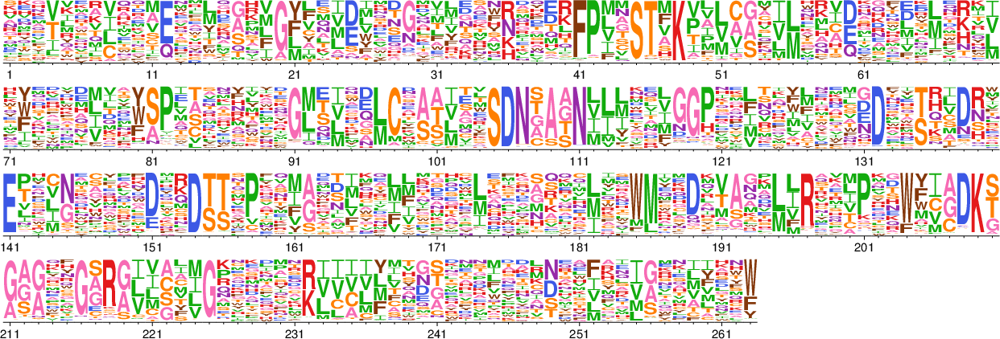
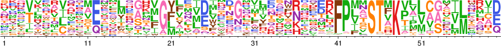
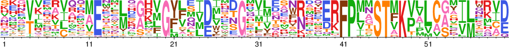
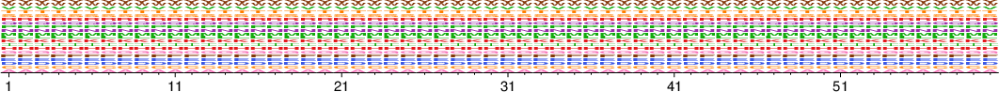
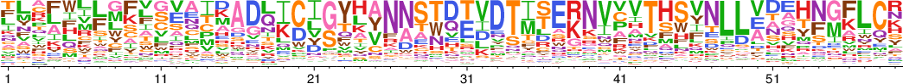
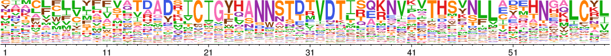
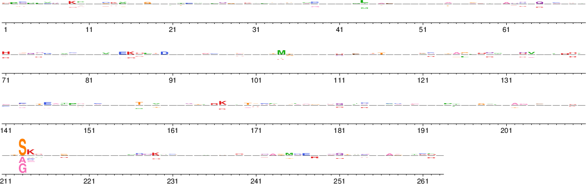

In this tutorial you will learn the basics of [`phydms`](http://jbloomlab.github.io/phydms/index.html). We will walk through examples of analyses you may want to run to compare your deep mutational scanning data to natural sequence evolution. For more details on any of the steps, please see the [phydms documentation](http://jbloomlab.github.io/phydms/index.html).     

[`phydms`](http://jbloomlab.github.io/phydms/index.html) was developed at the [Bloom Lab](http://research.fhcrc.org/bloom/en.html) ([full list of contributors](https://github.com/jbloomlab/phydms/graphs/contributors))

#Comparing your `DMS` data to natural sequence evolution  
After you perform your deep mutational scanning experiment, you may want to know how well the experimental measurements you made in the lab describe the natural sequence evolution of your protein. Using [`phydms`](http://jbloomlab.github.io/phydms/phydms_prog.html) you can compare the phylogenetic substitution model [*ExpCM*](https://academic.oup.com/mbe/article/31/10/2753/1015257/An-Experimentally-Informed-Evolutionary-Model), which takes into account the site-specific amino-acid preferences from your deep mutational scanning experiment, to traditional, non-site specific models from the [*YNGKP*](http://www.genetics.org/content/155/1/431) family. [`phydms_comprehensive`](http://jbloomlab.github.io/phydms/phydms_comprehensive_prog.html) will run [`phydms`](http://jbloomlab.github.io/phydms/phydms_prog.html) in several different modes to generate results for the appropriate comparisons.   

For the standard [`phydms_comprehensive`](http://jbloomlab.github.io/phydms/phydms_comprehensive_prog.html) analysis, you will need [amino-acid preferences](#prefs) from your deep mutational scanning experiment and a codon-level sequence [alignment](#seqs) of your gene. [`phydms_comprehensive`](http://jbloomlab.github.io/phydms/phydms_comprehensive_prog.html) will then   

• infer a tree using [`RAxML`](http://sco.h-its.org/exelixis/software.html)  
• run [`phydms`](http://jbloomlab.github.io/phydms/phydms_prog.html) with the *YNGKP_M0*, the *YNKGP_M5*, the *ExpCM*, and a control *ExpCM* run with averaged preferences  
• summarize the results  

See the [full documentation](http://jbloomlab.github.io/phydms/index.html) for specifics on these models.  

We are going to walk through an example of [`phydms_comprehensive`](http://jbloomlab.github.io/phydms/phydms_comprehensive_prog.html) for the $\beta$-lactamase gene. We will compare an *ExpCM* with deep mutational scanning data from [Stiffler *et al*, 2015](http://www.sciencedirect.com/science/article/pii/S0092867415000781) to the *YNGKP* family of models. 

##`phydms_comprehensive` command-line usage
Here is the full list of requirements and options for [`phydms_comprehensive`](http://jbloomlab.github.io/phydms/phydms_comprehensive_prog.html). Below is a discussion of the [input files](#inputFiles), running the [`phydms_comprehensive` command](#phydms_comprehensiveCommand), and [interpretation of the results](#interpretation).   

```{r phydms_comprehensive help, engine='bash', comment=NA, error=TRUE}
phydms_comprehensive -h
```   

##Input Files{#inputFiles}
This example uses the following files: [`betaLactamase_enrichmentScores.csv`](example_data/betaLactamase_enrichmentScores.csv), [`betaLactamase_prefs.csv`](example_data/betaLactamase_prefs.csv), and [`betaLactamase_alignment.fasta`](example_data/betaLactamase_alignment.fasta).

###Amino-acid preferences{#prefs}
Often data from deep mutational scanning experiments is reported as the enrichment of a given amino acid compared to the wild-type amino acid. 
Here is a snippet of the log enrichment scores for $\beta$-lactamase from the file [betaLactamase_enrichmentScores.csv](example_data/betaLactamase_enrichmentScores.csv) ([Stiffler *et al*, 2015 `Supplemental File 1`](http://www.sciencedirect.com/science/article/pii/S0092867415000781)) and the full dataset visualized as a heatmap.

```{r enrichment scores heatmap, comment=NA, warning=FALSE, fig.width = 15, fig.height = 10}
library(ggplot2)
df = read.csv("example_data/betaLactamase_enrichmentScores.csv")
head(df,6)
base_size <- 15
p <- ggplot(df, aes(Site, AminoAcid)) + geom_tile(aes(fill = Trial_1_AmpConc_2500),colour = "white") + scale_fill_gradient(low = "white",high = "steelblue") + guides(fill = guide_legend(title = "Enrichment relative to \nwildtype amino acid"))
p = p + theme_grey(base_size = base_size) + scale_x_discrete(expand = c(0, 0)) + scale_y_discrete(expand = c(0, 0))
p

```     

[`phydms`](http://jbloomlab.github.io/phydms/phydms_prog.html) uses *amino-acid preferences* rather than *enrichment scores*. We can transform these log enrichment scores to amino-acid preferences by normalizing the exponentiation of the scores for each site. Below are the first few sites and amino acids of the resulting [preferences](example_data/betaLactamase_prefs.csv). Notice that the numbering has changed from above. In [`phydms`](http://jbloomlab.github.io/phydms/phydms_prog.html) a site is numbered in relation to the first site in the preferences rather than to the start codon.   

```{r enrichment scores to preferences, engine="python", comment=NA}
import pandas as pd
df = pd.read_csv("example_data/betaLactamase_enrichmentScores.csv")
minenrichment = 1.0e-4 # minimum allowed enrichment
df["preference"] = [max(minenrichment, (10**df["Trial_1_AmpConc_2500"][x] + 10**df["Trial_1_AmpConc_2500"][x])/2) for x in range(len(df))]
df = df.pivot(index = "Site", columns = "AminoAcid", values = "preference")
df.fillna(1, inplace = True)
df = df.div(df.sum(axis=1), axis=0)
df.insert(0, "site", range(1,len(df)+1))
df.to_csv("example_data/betaLactamase_prefs.csv", index = False)
print df.iloc[:,:9].head(6).to_string(index = False)
```   

We can visualize the preferences as a logoplot using [phydms_logoplot](http://jbloomlab.github.io/phydms/phydms_logoplot.html):  
```{r bacLactamase logoplot, engine="bash", comment=NA, error=TRUE, include=FALSE}
phydms_logoplot logoplots/betaLactamase_prefs.pdf --prefs example_data/betaLactamase_prefs.csv --mapmetric functionalgroup --colormap mapmetric
```

```{r bacLactamase logoplot convert, engine="bash", comment=NA, error=TRUE, include=FALSE}
convert -density 134 -trim logoplots/betaLactamase_prefs.pdf +append logoplots/betaLactamase_prefs.png
```



For more information on the preference file formats, please see the [full `phydms` documentation](http://jbloomlab.github.io/phydms/phydms_prog.html). For more detailed information on transforming enrichment scores into amino-acid preferences, please see [`dms_tools`: Algorithm to infer site-specific preferences](http://jbloomlab.github.io/dms_tools/inferprefs_algorithm.html).

###Sequences{#seqs}
We will use an [alignment](example_data/betaLactamase_alignment.fasta) of $\beta$-lactamase sequences. It is important to note there is exactly the same number of preferences as sites in the alignment. 
```{r alignment, engine="python", comment=NA, echo = FALSE}   
import pandas as pd
from Bio import SeqIO
seqFileName = "example_data/betaLactamase_alignment.fasta"
prefFileName = "example_data/betaLactamase_prefs.csv"
sequences = list(SeqIO.parse(open(seqFileName),'fasta'))
assert len(set([len(x.seq) for x in sequences ])) == 1
print "Sequences read from: %s"%seqFileName
print "There are %s sequences"%len(sequences)
print "Each sequence is %s amino acids long"%str(len(sequences[0].seq)/3)
print "Preferences read from: %s"%prefFileName
print "There are preferences measured for %s sites"%len(pd.read_csv(prefFileName))
```  

You can use the [`phydms`](http://jbloomlab.github.io/phydms/phydms_prog.html) auxiliary program [`phydms_prepalignment`](http://jbloomlab.github.io/phydms/phydms_prepalignment.html) to filter your sequences and prepare an alignment for [`phydms_comprehensive`](http://jbloomlab.github.io/phydms/phydms_comprehensive_prog.html).  

###`phydms_comprehensive`{#phydms_comprehensiveCommand}
We can now run [`phydms_comprehensive`](http://jbloomlab.github.io/phydms/phydms_comprehensive_prog.html) by specifying our output prefix (in this case a directory called `betaLactamase`), our [preferences](#prefs), and our [alignment](#seqs). The output below is the [`phydms_comprehensive`](http://jbloomlab.github.io/phydms/phydms_comprehensive_prog.html) run log.  

<!-- code to run -->
```{r phydms_comprehensive run, engine='bash', comment=NA, error=TRUE}
phydms_comprehensive betaLactamase/ example_data/betaLactamase_alignment.fasta example_data/betaLactamase_prefs.csv --raxml raxml
```

##Output files{#outputFiles}

[`phydms_comprehensive`](http://jbloomlab.github.io/phydms/phydms_comprehensive_prog.html) produces both the standard [`phydms`](http://jbloomlab.github.io/phydms/phydms_prog.html) output files for each model and a summary file. Please see the [full documentation](http://jbloomlab.github.io/phydms/phydms.html) for more information on the standard output files. 

```{r phydms_comprehensive output files, engine='bash', comment=NA, error=TRUE}
ls betaLactamase/*
```   

##Interpretation of `phydms_comprehensive` results{#interpretation}

To compare the *ExpCM* with $\beta$-lactamase deep mutational scanning data to the *YNGKP* family we can look at the summary file [`modelcomparison.md`](betaLactamase/modelcomparison.md).   


| Model                              | deltaAIC | LogLikelihood | nParams | ParamValues                                   |
|------------------------------------|----------|---------------|---------|-----------------------------------------------|
| ExpCM_betaLactamase_prefs          | 0.00     | -2592.16      | 6       | beta=1.36, kappa=2.64, omega=0.69             |
| YNGKP_M5                           | 717.42   | -2944.87      | 12      | alpha_omega=0.30, beta_omega=0.49, kappa=3.02 |
| averaged_ExpCM_betaLactamase_prefs | 794.48   | -2989.40      | 6       | beta=0.82, kappa=2.36, omega=0.28             |
| YNGKP_M0                           | 819.26   | -2996.79      | 11      | kappa=2.39, omega=0.28                        |


**First, we can see the *ExpCM* has the largest log-likelihood of all four of the models.** It significantly outperforms (evaluated by the $\Delta$AIC) the non-site-specific *YNGKP* models. It also outperforms the *ExpCM* control where the preferences are averaged across the sites rendering the model non-site-specific.
**These comparisons are evidence that the *ExpCM* model informed by the deep mutational scanning results describes the natural evolution of $\beta$-lactamase better than traditional, non-site-specific models.**

```{r stringency example logoplot, engine="bash", comment=NA, error=TRUE, echo=FALSE, include=FALSE}
phydms_logoplot logoplots/betaLactamase_prefs_beta1.pdf --prefs logoplots/example_data/betaLactamase_prefs_short.csv --mapmetric functionalgroup --colormap mapmetric
phydms_logoplot logoplots/betaLactamase_prefs_beta0.pdf --prefs logoplots/example_data/betaLactamase_prefs_short.csv  --stringency 0 --mapmetric functionalgroup --colormap mapmetric
phydms_logoplot logoplots/betaLactamase_prefs_beta3.pdf --prefs logoplots/example_data/betaLactamase_prefs_short.csv  --stringency 3 --mapmetric functionalgroup --colormap mapmetric
```

```{r HA stringency example logoplot convert, engine="bash", comment=NA, error=TRUE, echo=FALSE, include=FALSE}
convert -density 134 -trim logoplots/betaLactamase_prefs_beta1.pdf +append logoplots/betaLactamase_prefs_beta1.png
convert -density 134 -trim logoplots/betaLactamase_prefs_beta0.pdf +append logoplots/betaLactamase_prefs_beta0.png
convert -density 134 -trim logoplots/betaLactamase_prefs_beta3.pdf +append logoplots/betaLactamase_prefs_beta3.png
```  
We can also evaluate the amino-acid preferences by the value of the *ExpCM* stringency parameter, $\beta$. $\beta$ is a way to gauge how well the selection in the lab compares to selection in nature. When $\beta$ is fit to be greater than $1$ it means the selection in nature prefers the same amino acids but with a greater stringency. The converse is true when $\beta$ is less than $1$. When our preferences are re-scaled with a $\beta>1$, we see the strongly preferred amino acids "grow" while the weakly preferred amino acids "shrink".  

  

  

When $\beta=0$, the heights become uniform and the *ExpCM* loses all of its site-specific information.  
  

In the $\beta$-lactamase example, $\beta$ is fit to be $1.36$. **Since this number is close to $1$, we can conclude that not only is the *ExpCM* with amino-acid preferences a better description of natural sequence evolution than non-site specific models but that natural evolution prefers the same amino acids that are preferred in the experiment, but with slightly greater stringency.** For more information on scaling amino-acid preferences by $\beta$, please see [Bloom, 2014](http://research.fhcrc.org/content/dam/stripe/bloom/labfiles/publications/Bloom2014b.pdf).

Please see the [full documentation](http://jbloomlab.github.io/phydms/index.html) if you would like to learn more about the [`phydms_comprehensive`](http://jbloomlab.github.io/phydms/phydms_comprehensive_prog.html) program and its other options. 
 
#Comparing two `DMS` datasets for the same protein
If you perform a deep mutational scanning experiment multiple times under slightly different experimental conditions, you may want to compare how well each dataset explains natural sequence variation. These experimental differences could be in how the variant libraries were generated, how the selection pressure was exerted, etc. We can use [`phydms_comprehensive`](http://jbloomlab.github.io/phydms/phydms_comprehensive_prog.html) to compare *ExpCM* models with two or more different sets of preferences to both the *YNGKP* family of models and to each other.

For this [`phydms_comprehensive`](http://jbloomlab.github.io/phydms/phydms_comprehensive_prog.html) analysis, you will need multiple sets of [amino-acid preferences](#prefsHA) for the same protein from your deep mutational scanning experiments and a codon-level sequence [alignment](#seqsHA) of your gene. [`phydms_comprehensive`](http://jbloomlab.github.io/phydms/phydms_comprehensive_prog.html) will then

• infer a tree using [`RAxML`](http://sco.h-its.org/exelixis/software.html)   
• run [`phydms`](http://jbloomlab.github.io/phydms/phydms_prog.html) with the *YNGKP_M0*, the *YNKGP_M5* and the *ExpCM* (with and without averaged preferences) for each set of preferences   
• summarize the results   

See the [full documentation](http://jbloomlab.github.io/phydms/index.html) for specifics on these models or the [`phydms_comprehensive`](http://jbloomlab.github.io/phydms/phydms_comprehensive_prog.html) program.

We are going to walk through an example of [`phydms_comprehensive`](http://jbloomlab.github.io/phydms/phydms_comprehensive_prog.html) and compare *ExpCM*s with amino-acid preferences for the influenza virus protein hemagglutinin described in [Thyagarajan and Bloom, 2014](http://research.fhcrc.org/content/dam/stripe/bloom/labfiles/publications/ThyagarajanAndBloom2014.pdf) and [Doud and Bloom, 2016](http://www.mdpi.com/1999-4915/8/6/155).

##`phydms_comprehensive` command-line usage

Here is the full list of requirements and options for [`phydms_comprehensive`](http://jbloomlab.github.io/phydms/phydms_comprehensive_prog.html). Below is a discussion of the [input files](#inputFilesHA), running the [`phydms_comprehensive` command](#phydms_comprehensiveCommandHA), and [interpretation of the results](#interpretationHA).

```{r phydms_comprehensive HA help, engine='bash', comment=NA, error=TRUE}
phydms_comprehensive -h
```

##Input Files{#inputFilesHA}
This example uses the following files: [`HA_prefs_Thyagarajan.csv`](example_data/HA_prefs_Thyagarajan.csv), [`HA_prefs_Doud.csv`](example_data/HA_prefs_Doud.csv), and [`HA_alignment.fasta`](example_data/HA_alignment.fasta).

###Amino-acid preferences{#prefsHA}

The HA amino-acid preferences from [Thyagarajan and Bloom, 2014](http://research.fhcrc.org/content/dam/stripe/bloom/labfiles/publications/ThyagarajanAndBloom2014.pdf) and  [Doud and Bloom, 2016](http://www.mdpi.com/1999-4915/8/6/155) were measured using two different library construction strategies. (Please see [Thyagarajan and Bloom, 2014](http://research.fhcrc.org/content/dam/stripe/bloom/labfiles/publications/ThyagarajanAndBloom2014.pdf) and  [Doud and Bloom, 2016](http://www.mdpi.com/1999-4915/8/6/155) for more information on the reverse-genetics strategy and the helper virus strategy respectively). We would like to know if one set of preferences significantly changes the behavior of the *ExpCM* compared to the other set or the average of the two sets.

We can compare the amino-acid preference measurements found in [`HA_prefs_Thyagarajan.csv`](example_data/HA_prefs_Thyagarajan.csv) and [`HA_prefs_Doud.csv`](example_data/HA_prefs_Doud.csv) using [`phydms_logoplots`](http://jbloomlab.github.io/phydms/phydms_logoplot.html):

```{r HA logoplot, engine="bash", comment=NA, error=TRUE, echo=FALSE, include=FALSE}
phydms_logoplot logoplots/HA_prefs_Thyagarajan.pdf --prefs logoplots/example_data/HA_prefs_Thyagarajan_short.csv --mapmetric functionalgroup --colormap mapmetric
phydms_logoplot logoplots/HA_prefs_Doud.pdf --prefs logoplots/example_data/HA_prefs_Doud_short.csv --mapmetric functionalgroup --colormap mapmetric
```

```{r HA logoplot convert, engine="bash", comment=NA, error=TRUE, echo=FALSE, include=FALSE}
convert -density 134 -trim logoplots/HA_prefs_Thyagarajan.pdf +append logoplots/HA_prefs_Thyagarajan.png
convert -density 134 -trim logoplots/HA_prefs_Doud.pdf +append logoplots/HA_prefs_Doud.png
```





As we would expect, the preferences measured from the two experiments are similar but not identical.

For more information on how to change *enrichment scores* to *amino-acid preferences*, please see the [Comparing your `DMS` data to natural sequence evolution](#prefs) section of this tutorial.
For more information on the preference file formats, please see the [full `phydms` documentation](http://jbloomlab.github.io/phydms/phydms_prog.html) or an example in the [Comparing your `DMS` data to natural sequence evolution](#prefs) section of this tutorial.

###Sequences{#seqsHA}
We will use an [alignment](#example_data/HA_alignment.fasta) of HA sequences. It is important to note there is exactly the same number of preferences in each preference file as sites in the alignment.

```{r alignment AH, engine="python", comment=NA, echo = FALSE}
import pandas as pd
from Bio import SeqIO
import glob
seqFileName = "example_data/HA_alignment.fasta"
sequences = list(SeqIO.parse(open(seqFileName),'fasta'))
assert len(set([len(x.seq) for x in sequences ])) == 1
print "Sequences read from: %s"%seqFileName
print "There are %s sequences"%len(sequences)
print "Each sequence is %s amino acids long"%str(len(sequences[0].seq)/3)
print
for prefFileName in glob.glob("example_data/HA_prefs_*"):
  print "Preferences read from: %s"%prefFileName
  print "There are preferences measured for %s sites"%len(pd.read_csv(prefFileName))
```

You can use the [`phydms`](http://jbloomlab.github.io/phydms/phydms_prog.html) auxiliary program [`phydms_prepalignment`](http://jbloomlab.github.io/phydms/phydms_prepalignment.html) to filter your sequences and prepare an alignment for [`phydms_comprehensive`](http://jbloomlab.github.io/phydms/phydms_comprehensive_prog.html).

###`phydms_comprehensive`{#phydms_comprehensiveCommandHA}
We can now run [`phydms_comprehensive`](http://jbloomlab.github.io/phydms/phydms_comprehensive_prog.html) by specifying our output prefix (in this case a directory called `HA`), our [preferences](#prefsHA), and our [alignment](#seqsHA).

<!-- code to run -->
```{r phydms_comprehensive HA run, engine='bash', comment=NA, error=TRUE, results="hide"}
phydms_comprehensive HA/ example_data/HA_alignment.fasta example_data/HA_prefs_Thyagarajan.csv example_data/HA_prefs_Doud.csv --raxml raxml
```

##Output files
[`phydms_comprehensive`](http://jbloomlab.github.io/phydms/phydms_comprehensive_prog.html) produces both the standard [`phydms`](http://jbloomlab.github.io/phydms/phydms_prog.html) output files for each model and a summary file. See the the [Comparing your `DMS` data to natural sequence evolution](#outputFiles) section of the tutorial for an example and [full `phydms` documentation](http://jbloomlab.github.io/phydms/phydms.html) for more information on the standard output files.

##Interpretation of `phydms_comprehensive` results{#interpretationHA}

To compare the *ExpCM* with the different preferences, we can look at the summary file [`modelcomparison.md`](betaLactamase/modelcomparison.md).

| Model                               | deltaAIC | LogLikelihood | nParams | ParamValues                                   |
|-------------------------------------|----------|---------------|---------|-----------------------------------------------|
| ExpCM_HA_prefs_Doud                 | 0.00     | -4877.65      | 6       | beta=2.11, kappa=5.14, omega=0.52             |
| ExpCM_HA_prefs_Thyagarajan          | 44.18    | -4899.74      | 6       | beta=1.72, kappa=4.94, omega=0.55             |
| averaged_ExpCM_HA_prefs_Doud        | 2090.58  | -5922.94      | 6       | beta=0.68, kappa=5.36, omega=0.22             |
| averaged_ExpCM_HA_prefs_Thyagarajan | 2097.86  | -5926.58      | 6       | beta=0.31, kappa=5.36, omega=0.22             |
| YNGKP_M5                            | 2113.50  | -5928.40      | 12      | alpha_omega=0.30, beta_omega=1.42, kappa=4.68 |
| YNGKP_M0                            | 2219.64  | -5982.47      | 11      | kappa=4.61, omega=0.20                        |


First, we can see that both *ExpCM* models all have significantly larger (evaluated by the $\Delta$AIC) log-likelihoods than the two *ExpCM* with averaged preferences. These, in turn, have significantly larger log-likelihoods than the *YNGKP* family.  **Second, we can see the *ExpCM* with the preferences from [Doud and Bloom, 2016](http://www.mdpi.com/1999-4915/8/6/155) has a larger log-likelihood than then *ExpCM* with the [Thyagarajan and Bloom, 2014](http://research.fhcrc.org/content/dam/stripe/bloom/labfiles/publications/ThyagarajanAndBloom2014.pdf) preferences.**

These comparisons are evidence that the *ExpCM* with the [Doud and Bloom, 2016](http://www.mdpi.com/1999-4915/8/6/155) preferences is a better description of natural sequence evolution than the *ExpCM* with the [Thyagarajan and Bloom, 2014](http://research.fhcrc.org/content/dam/stripe/bloom/labfiles/publications/ThyagarajanAndBloom2014.pdf) preferences or either one of the non-site-specific models.

Please see the [full documentation](http://jbloomlab.github.io/phydms/index.html) if you would like to learn more about the [`phydms_comprehensive`](http://jbloomlab.github.io/phydms/phydms_comprehensive_prog.html) program and its other options.


#Detecting Diversifying Selection{#diversifyingSelection}

A deep mutational scanning experiment measures the amino-acid preferences of a given protein for a given selection pressure. However, it is not expected that the selection in lab faithfully describes the selection a protein faces in nature. We can use [`phydms_comprehensive`](http://jbloomlab.github.io/phydms/phydms_comprehensive_prog.html) and the flag `--omegabysite` to identify sites which deviate from the *ExpCM* model via an unexpectedly high or low rate of amino-acid substitution.  That is, we will be able to differentiate between sites which are under *diversifying selection*, a high rate, and sites which are under a selective constraint not measured in lab, a low rate. This is in contrast to [differential selection](#differentialSelection), which selects for unexpected amino-acid substitutions rather than unexpected rates.

For more information on the exact procedure, please see the [full documentation](http://jbloomlab.github.io/phydms/ExpCM.html#identifying-diversifying-selection-via-site-specific-values) or [Bloom, 2017](http://research.fhcrc.org/content/dam/stripe/bloom/labfiles/publications/Bloom2017.pdf).
This procedure is analogous to the [FEL method](http://www.datamonkey.org/help/fel.php) described by [Pond and Frost, 2005](https://academic.oup.com/bioinformatics/article/21/5/676/220389/HyPhy-hypothesis-testing-using-phylogenies).

We are going to walk through an example of [`phydms_comprehensive`](http://jbloomlab.github.io/phydms/phydms_comprehensive_prog.html) to detect sites under diversifying selection in influenza virus protein hemagglutinin using the preferences measured [Doud and Bloom, 2016](http://www.mdpi.com/1999-4915/8/6/155) and in $\beta$-lactamase using the preferences measured by [Stiffler *et al*, 2015](http://www.sciencedirect.com/science/article/pii/S0092867415000781).

##`phydms_comprehensive` command-line usage
Here is the full list of requirements and options for [`phydms_comprehensive`](http://jbloomlab.github.io/phydms/phydms_comprehensive_prog.html). To detect diversifying pressure, we are going to include the optional flag `--omegabysite`. Below is a discussion of the [input files](#inputFilesAll), running the [`phydms_comprehensive` command](#phydms_comprehensiveCommandAll), and [interpretation of the results](#interpretationAll).

```{r phydms_comprehensive omegabysite help, engine='bash', comment=NA, error=TRUE}
phydms_comprehensive -h
```

##Input Files{#inputFilesAll}
A full discussion of the amino-acid preferences and sequences for [$\beta$-lacatamse](#inputFiles) and [HA](#inputFilesHA) can be found in the earlier sections of this tutorial. Briefly,

```{r all files summary, engine="python", comment=NA, echo = FALSE}
import pandas as pd
from Bio import SeqIO

proteins = {"BetaLactamase":["example_data/betaLactamase_alignment.fasta", "example_data/betaLactamase_prefs.csv"], "HA":["example_data/HA_alignment.fasta", "example_data/HA_prefs_Doud.csv"]}
for protein in proteins.keys():
  seqFileName = proteins[protein][0]
  prefFileName = proteins[protein][1]
  sequences = list(SeqIO.parse(open(seqFileName),'fasta'))
  assert len(set([len(x.seq) for x in sequences ])) == 1
  print protein
  print "Sequences read from: %s"%seqFileName
  print "There are %s sequences"%len(sequences)
  print "Each sequence is %s amino acids long"%str(len(sequences[0].seq)/3)
  print "Preferences read from: %s"%prefFileName
  print "There are preferences measured for %s sites"%len(pd.read_csv(prefFileName))
  print
```

###`phydms_comprehensive`{#phydms_comprehensiveCommandAll}
We can now run [`phydms_comprehensive`](http://jbloomlab.github.io/phydms/phydms_comprehensive_prog.html) by specifying our output prefix (in this case a directory called `HA_omegabysite` or `betaLactmase_omegabysite`), our [preferences](#inputFilesAll), our [alignment](#inputFilesAll) and the flag `--omegabysite`. Each alignment requires its own [`phydms_comprehensive`](http://jbloomlab.github.io/phydms/phydms_comprehensive_prog.html) run. 

<!-- code to run -->
```{r diversifying selection HA, engine='bash', comment=NA, error=TRUE, results="hide"}
phydms_comprehensive HA_omegabysite/ example_data/HA_alignment.fasta example_data/HA_prefs_Doud.csv --raxml raxml --omegabysite

phydms_comprehensive betaLactamase_omegabysite/ example_data/betaLactamase_alignment.fasta example_data/betaLactamase_prefs.csv --raxml raxml --omegabysite
```

##Output files
[`phydms_comprehensive`](http://jbloomlab.github.io/phydms/phydms_comprehensive_prog.html) produces both the standard [`phydms`](http://jbloomlab.github.io/phydms/phydms_prog.html) output files for each model and a summary file. See the [Comparing your `DMS` data to natural sequence evolution](#outputFiles) section of the tutorial for an example and the [full `phydms` documentation](http://jbloomlab.github.io/phydms/phydms.html) for more information on the standard output files.  

##Interpretation of `phydms_comprehensive` results{#interpretationAll}

To detect sites under diversifying selection, we can look at the summary files with the suffix `_omegabysite.txt`. First, we will look at the results from the HA analysis.

[HA_omegabysite/ExpCM_HA_prefs_Doud_omegabysite.txt](HA_omegabysite/ExpCM_HA_prefs_Doud_omegabysite.txt) lists the site, the fitted $\omega_r$ value, the p-value for the hypothesis $H_0: \omega_r = 1$, the dLnL (difference in log-likelihood between *ExpCM* with $\omega_r = 1$ and the *ExpCM* with the fitted $\omega_r$ value), and the Q-value, which controls for multiple comparisons via the false discovery rate. For more information on these metrics, please see the [full `phydms_comprehensive` documentation](http://jbloomlab.github.io/phydms/phydms_prog.html#site-specific-omega-file). The sites are sorted by the p-value which means the sites with the strongest evidence for deviations from $\omega_r = 1$ will be at the top of the file.

```{r phydms_comprehensive HA omegabysite head, engine='bash', comment=NA, error=TRUE}
head -n 20 HA_omegabysite/ExpCM_HA_prefs_Doud_omegabysite.txt
```
and sites with the weakest evidence for deviation from $\omega_r = 1$ will be at the bottom of the file.
```{r phydms_comprehensive HA omegabysite tail, engine='bash', comment=NA, error=TRUE}
tail -n 20 HA_omegabysite/ExpCM_HA_prefs_Doud_omegabysite.txt
```

You will notice that the sites with strong evidence have a fitted $\omega_r$ that is either very large ($100$) or very small ($0$) while the sites with weak evidence have a fitted $\omega_r$ close to $1$.

Here are the sites in $\beta$-lactamase with the strongest evidence for deviations from $\omega_r = 1$
```{r phydms_comprehensive beta omegabysite head, engine='bash', comment=NA, error=TRUE}
head -n 20 betaLactamase_omegabysite/ExpCM_betaLactamase_prefs_omegabysite.txt
```

We can see in both examples there is a small subset of sites which deviate display a faster ($\omega_r>1$) or slower ($\omega_r <1$) than expected rate of amino-acid substitutions. 

#Detecting Differential Selection{#differentialSelection}

A deep mutational scanning experiment measures the amino-acid preferences of a given protein for a given selection pressure. However, it is not expected that the selection in lab faithfully describes the selection a protein faces in nature.  We can use [`phydms_comprehensive`](http://jbloomlab.github.io/phydms/phydms_comprehensive_prog.html) and the flag `--diffprefsbysite` to identify sites which deviate from the *ExpCM* model via *differential selection*.  In contrast to [diversifying selection](#diversifyingSelection), differential selection leads to unexpected amino-acid substitutions rather than unexpected rates.

For more information on the exact procedure, please see the [full documentation](http://jbloomlab.github.io/phydms/ExpCM.html#identifying-differentially-selected-amino-acids-by-fitting-preferences-for-each-site) or [Bloom, 2017](http://research.fhcrc.org/content/dam/stripe/bloom/labfiles/publications/Bloom2017.pdf).

We are going to walk through an example of [`phydms_comprehensive`](http://jbloomlab.github.io/phydms/phydms_comprehensive_prog.html) to detect sites under differential selection in influenza virus protein hemagglutinin using the preferences measured [Doud and Bloom, 2016](http://www.mdpi.com/1999-4915/8/6/155) and in $\beta$-lactamase using the preferences measured by [Stiffler *et al*, 2015](http://www.sciencedirect.com/science/article/pii/S0092867415000781).

##`phydms_comprehensive` command-line usage
Here is the full list of requirements and options for [`phydms_comprehensive`](http://jbloomlab.github.io/phydms/phydms_comprehensive_prog.html). To detect diversifying pressure, we are going to include the optional flag `--diffprefsbysite`. Below is a discussion of the [input files](#inputFilesdiff), running the [`phydms_comprehensive` command](#phydms_comprehensiveCommanddiff), and [interpretation of the results](#interpretationdiff).

```{r phydms_comprehensive diff help, engine='bash', comment=NA, error=TRUE}
phydms_comprehensive -h
```

##Input Files{#inputFilesdiff}

A full discussion of the amino-acid preferences and sequences for [$\beta$-lacatamse](#inputFiles) and [HA](#inputFilesHA) can be found in the earlier sections of this tutorial. Briefly,

```{r all files summary diff, engine="python", comment=NA, echo = FALSE}
import pandas as pd
from Bio import SeqIO

proteins = {"BetaLactamase":["example_data/betaLactamase_alignment.fasta", "example_data/betaLactamase_prefs.csv"], "HA":["example_data/HA_alignment.fasta", "example_data/HA_prefs_Doud.csv"]}
for protein in proteins.keys():
  seqFileName = proteins[protein][0]
  prefFileName = proteins[protein][1]
  sequences = list(SeqIO.parse(open(seqFileName),'fasta'))
  assert len(set([len(x.seq) for x in sequences ])) == 1
  print protein
  print "Sequences read from: %s"%seqFileName
  print "There are %s sequences"%len(sequences)
  print "Each sequence is %s amino acids long"%str(len(sequences[0].seq)/3)
  print "Preferences read from: %s"%prefFileName
  print "There are preferences measured for %s sites"%len(pd.read_csv(prefFileName))
  print
```

###`phydms_comprehensive`{#phydms_comprehensiveCommanddiff}
We can now run [`phydms_comprehensive`](http://jbloomlab.github.io/phydms/phydms_comprehensive_prog.html) by specifying our output prefix (in this case a directory called `HA_diffprefs` or `betaLactmase_diffprefs`), our [preferences](#inputFilesdiff), our [alignment](#inputFilesdiff) and the flag `--diffprefsbysite`. Each alignment requires its own [`phydms_comprehensive`](http://jbloomlab.github.io/phydms/phydms_comprehensive_prog.html) run. 

<!-- code to run -->
```{r diff selection HA, engine='bash', comment=NA, error=TRUE, results="hide"}
phydms_comprehensive HA_diffprefs/ example_data/HA_alignment.fasta example_data/HA_prefs_Doud.csv --raxml raxml --diffprefsbysite

phydms_comprehensive betaLactamase_diffprefs/ example_data/betaLactamase_alignment.fasta example_data/betaLactamase_prefs.csv --raxml raxml --diffprefsbysite
```

##Output files
[`phydms_comprehensive`](http://jbloomlab.github.io/phydms/phydms_comprehensive_prog.html) produces both the standard [`phydms`](http://jbloomlab.github.io/phydms/phydms_prog.html) output files for each model and a summary file. See the [Comparing your `DMS` data to natural sequence evolution](#outputFiles) section of the tutorial for an example and the [full `phydms` documentation](http://jbloomlab.github.io/phydms/phydms.html) for more information on the standard output files.  

##Interpretation of `phydms_comprehensive` results{#interpretationdiff}
To detect sites under differential selection, we can look at the summary files with the suffix `diffprefsbysite.txt`. First, we will look at the results from the HA analysis.

[HA_diffprefs/ExpCM_HA_prefs_Doud_diffprefsbysite.txt](HA_diffprefs/ExpCM_HA_prefs_Doud_diffprefsbysite.txt) lists the site, the differential preference for each amino acid, and half absolute sum of the differential preferences for that site. A large differential preference value means that substitutions to that amino acid were seen at that site in the alignment *more* often than expected given the *ExpCM* and the measured amino-acid preferences. The last column can be used as a summary of differential selection strength for a given site. Larger values indicate the site is being strongly deferentially selected. For more information on these metrics, please see the [full `phydms_comprehensive` documentation](http://jbloomlab.github.io/phydms/phydms_prog.html#site-specific-differential-selection).

Here are the sites (and a subset of the differential preferences) in HA with the strongest evidence for differential selection

```{r phydms_comprehensive HA diff head, engine='python', comment=NA, error=TRUE}
import pandas as pd
df = pd.read_csv("HA_diffprefs/ExpCM_HA_prefs_Doud_diffprefsbysite.txt", sep='\t', skiprows=(0,1,2))
print df.iloc[:,range(9) + [-1]].head(6).to_string(index = False)
```

and sites with the weakest evidence
```{r phydms_comprehensive HA diff tail, engine='python', comment=NA, error=TRUE}
import pandas as pd
df = pd.read_csv("HA_diffprefs/ExpCM_HA_prefs_Doud_diffprefsbysite.txt", sep='\t', skiprows=(0,1,2))
print df.iloc[:,range(9) + [-1]].tail(6).to_string(index = False)
```

Here are the sites in $\beta$-lactamase with the strongest evidence for differential selection
```{r phydms_comprehensive beta diff head, engine='python', comment=NA, error=TRUE}
import pandas as pd
df = pd.read_csv("betaLactamase_diffprefs/ExpCM_betaLactamase_prefs_diffprefsbysite.txt", sep='\t', skiprows=(0,1,2))
print df.iloc[:,range(9) + [-1]].head(6).to_string(index = False)
```

We visualize the $\beta$-lactamase differential preferences for each site using [`phydms_logoplot`](http://jbloomlab.github.io/phydms/phydms_logoplot.html)  

```{r diff example logoplot, engine="bash", comment=NA, error=TRUE, results="hide"}
phydms_logoplot logoplots/betaLactamase_prefs_diff.pdf --mapmetric functionalgroup --colormap mapmetric --diffprefs betaLactamase_diffprefs/ExpCM_betaLactamase_prefs_diffprefsbysite.txt
```

```{r diff stringency example logoplot convert, engine="bash", comment=NA, error=TRUE, echo=FALSE, include=FALSE}
convert -density 134 -trim logoplots/betaLactamase_prefs_diff.pdf +append logoplots/betaLactamase_prefs_diff.png
```  

  

We can see in both the HA and the $\beta$-lactamase example, there are a small subset of sites which appear to be under differential selection.
